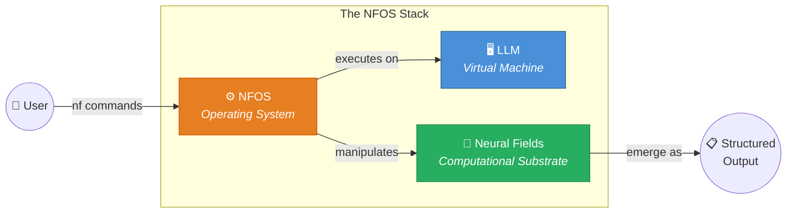
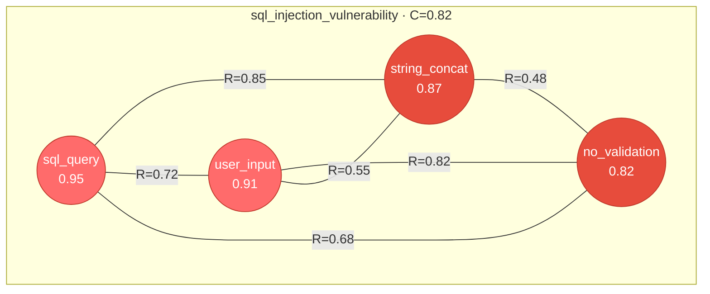
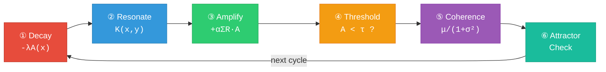
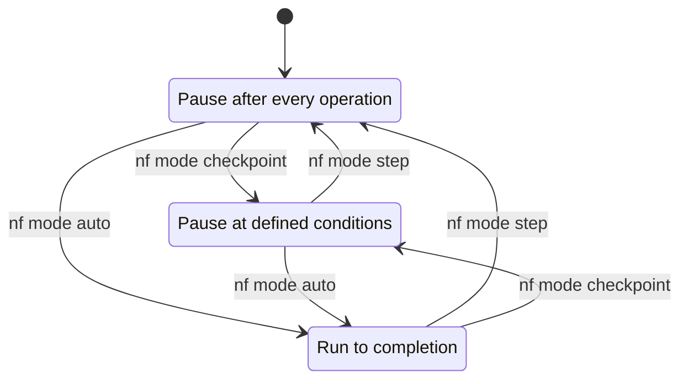
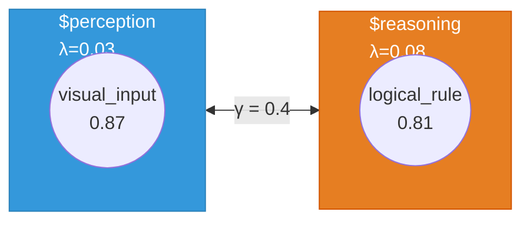

<div align="center">

# NFOS — Neural Field Operating System

[](.)
[](.)
[](.)
[](.)

**An executable runtime for neural field reasoning, where the LLM is the machine and meaning is the substrate.**

> *"The last operating system will not manage files. It will manage meaning."*

</div>

---

## What is NFOS?

NFOS turns an LLM into a **semantic computer**. You type shell commands. The LLM executes field dynamics — decay, resonance, amplification, attractor emergence — on the ideas you inject, and returns structured results. There is nothing to install: the LLM *is* the machine.



- **Shell-like command interface** — `nf inject`, `nf cycle`, `nf collapse` — direct control over field operations, no prompt engineering
- **Emergent analysis** — patterns you inject resonate, compete, and self-organize into attractors representing stable conclusions
- **Full state persistence** — git-like versioning with commits, branches, diffs, and merges on your field state
- **Configurable autonomy** — from step-by-step debugging to fully autonomous task execution, adjustable at any point
- **Dual perspective** — switch between semantic (natural language) and algebraic (mathematical) views of the same field

> [!IMPORTANT]
> Instead of prompting, you **operate a semantic machine**. Patterns are data. Resonance is computation. Attractors are results.

---

## Getting Started

> [!IMPORTANT]
> **There is nothing to install.** NFOS runs entirely inside an LLM's context window. No packages, no dependencies, no runtime.

**Three steps to your first session:**

1. **Copy** the kernel prompt from [`prompts/nfos-kernel.md`](prompts/nfos-kernel.md)
2. **Paste** it as the system prompt for your LLM conversation
3. **Type** your first command:

```bash
> nf session new "My First Analysis"
╔═══════════════════════════════════════════════════════════╗
║            NEURAL FIELD OPERATING SYSTEM v1.0             ║
╚═══════════════════════════════════════════════════════════╝

[SESSION] Created: My First Analysis
  Field: main (default)
  Parameters: λ=0.05, α=0.30, τ=0.40, σ=0.50
  Mode: step (interactive)

Type 'nf help' for command reference
```

> [!NOTE]
> NFOS runs entirely inside the LLM's context window. The "field" is maintained as structured state within the conversation. Every command reads and modifies that state — the LLM *is* the execution environment.

---

## Tutorial: Your First Session

A complete walkthrough — analyze code for security vulnerabilities using neural field dynamics.

### Step 1 — Inject patterns

You've reviewed some code and noticed several concerns. Inject each one as a named pattern with a strength between 0 and 1:

```bash
> nf inject "sql_query_construction" 0.9
[INJECT] sql_query_construction (s: 0.90)
  Field: main | Patterns active: 1

> nf inject "user_input_handling" 0.85
[INJECT] user_input_handling (s: 0.85)
  Patterns active: 2
  [IMMEDIATE RESONANCE] ↔ @sql_query_construction: R = 0.72

> nf inject "string_concatenation" 0.8
[INJECT] string_concatenation (s: 0.80)
  Patterns active: 3
  [IMMEDIATE RESONANCE]
    ↔ @sql_query_construction: R = 0.85
    ↔ @user_input_handling: R = 0.55

> nf inject "no_input_validation" 0.75
[INJECT] no_input_validation (s: 0.75)
  Patterns active: 4
```

> [!TIP]
> Strength reflects your confidence. Use 0.9 for strong signals, 0.5–0.7 for hunches. The dynamics will sort out what matters — weak patterns decay unless other patterns reinforce them.

### Step 2 — Observe resonance

Before running dynamics, check what the field already sees:

```bash
> nf resonate --all --above 0.5
[RESONANCE] All pairs (R > 0.5)
  @sql_query_construction ↔ @string_concatenation: 0.85 [STRONG]
  @user_input_handling ↔ @no_input_validation:     0.82 [STRONG]
  @sql_query_construction ↔ @user_input_handling:   0.72 [STRONG]
  @sql_query_construction ↔ @no_input_validation:   0.68 [MODERATE]
  @user_input_handling ↔ @string_concatenation:     0.55 [MODERATE]

  Mean resonance: 0.72
  Clusters forming: 1 (all connected)
```

Resonance is computed across three dimensions — **semantic** (meaning overlap), **logical** (inferential support), and **contextual** (domain fit) — combined as a geometric mean.

### Step 3 — Run dynamics

Now let the field evolve. Each cycle applies decay, computes resonance, amplifies reinforcing patterns, and checks for attractor emergence:

```bash
> nf cycle 3 --trace
[CYCLE 1]
  DECAY: Applied λ=0.05
    @sql_query_construction: 0.90 → 0.86
    @user_input_handling:    0.85 → 0.81
    @string_concatenation:   0.80 → 0.76
    @no_input_validation:    0.75 → 0.71

  RESONANCE:
    @sql_query_construction ↔ @string_concatenation: R = 0.85 [STRONG]
      Semantic: both about building query strings
      Logical: concatenation is HOW queries are built unsafely
    @user_input_handling ↔ @no_input_validation: R = 0.82 [STRONG]
      Semantic: input processing concerns
      Logical: lack of validation IS a handling issue

  AMPLIFY:
    @sql_query_construction: 0.86 → 0.94 (resonance boost)
    @user_input_handling:    0.81 → 0.89 (resonance boost)
    @string_concatenation:   0.76 → 0.84 (resonance boost)
    @no_input_validation:    0.71 → 0.79 (resonance boost)

  COHERENCE: 0.72 [HIGH]

[CYCLE 2]
  ...
  [ATTRACTOR-EMERGED] "sql_injection_vulnerability"
    Core: {@sql_query_construction, @user_input_handling,
           @string_concatenation, @no_input_validation}
    Coherence: 0.82

[CYCLE 3]
  [ATTRACTOR] sql_injection_vulnerability — stable
  COHERENCE: 0.82 [HIGH]
```

> [!NOTE]
> **What just happened?** Every cycle, patterns lose a bit of activation (decay), then gain it back if other patterns reinforce them (resonance → amplification). Patterns that resonate strongly cluster together. When a cluster crosses the coherence and stability thresholds, it becomes an **attractor** — a stable conclusion the field has converged on.

### Step 4 — Visualize

See the resonance network as a graph:

```bash
> nf plot network
```



Node size reflects activation strength. Edge labels show resonance. All four patterns are inside the attractor boundary — they mutually reinforce.

### Step 5 — Collapse to output

Convert the field state into a structured result:

```bash
> nf collapse --strategy attractor
[COLLAPSE] Strategy: attractor
  Dominant attractor: sql_injection_vulnerability (0.82)

OUTPUT:
  FINDING: SQL Injection Vulnerability

  The field analysis has converged on a SQL injection vulnerability
  pattern with high confidence (coherence: 0.82).

  EVIDENCE:
    • SQL queries constructed dynamically (A=0.95)
    • User input incorporated into queries (A=0.91)
    • String concatenation used for query building (A=0.87)
    • Input validation absent (A=0.82)

  RECOMMENDATION:
    1. Use parameterized queries or prepared statements
    2. Implement input validation and sanitization
    3. Apply principle of least privilege for database access

  CONFIDENCE: HIGH (0.82)
```

### Step 6 — Save and branch

Commit your findings, then explore an alternative:

```bash
> nf commit "SQL injection vulnerability identified"
[COMMIT] a1b2c3d: "SQL injection vulnerability identified"
  Patterns: 4 | Attractors: 1 | Coherence: 0.82

> nf branch create mitigation_analysis
[BRANCH] Created: mitigation_analysis

> nf inject "parameterized_queries" 0.9 --tags mitigation
> nf inject "input_validation" 0.85 --tags mitigation
> nf cycle 3 --compact
[CYCLES 1-3]
  1: C=0.55, 6 patterns (competition)
  2: C=0.48, 5 patterns (no_input_validation decaying)
  3: C=0.72, 5 patterns [NEW ATTRACTOR: secure_pattern]
```

### Step 7 — Compare branches

```bash
> nf checkout main
[CHECKOUT] main (a1b2c3d)

> nf diff mitigation_analysis
[DIFF] main..mitigation_analysis
  Added:   +@parameterized_queries (0.88), +@input_validation (0.85)
  Changed: @no_input_validation 0.82 → 0.25 [ATTENUATED]
  Attractors: sql_injection_vulnerability → secure_pattern

  Summary: Mitigation patterns successfully competed with
  vulnerability patterns, establishing a secure attractor.
```

> [!TIP]
> Branching lets you explore "what if" scenarios without losing your original analysis. This is version control for *reasoning*, not files.

---

## How It Works: The Master Equation

All dynamics in NFOS derive from a single field equation:

```
∂A/∂t = -λA(x) + α∫K(x,y)A(y)dy + ι(x,t)
         ─┬──     ─────┬──────     ──┬──
          │             │             │
        Decay       Resonance     Injection
```

| Term | What it does | Intuition |
|------|-------------|-----------|
| **−λA(x)** | Exponential decay | Ideas fade unless reinforced — prevents stale patterns from lingering |
| **α∫K(x,y)A(y)dy** | Resonance integral | Patterns that mean related things amplify each other — the "hearing" mechanism |
| **ι(x,t)** | External injection | New ideas you add via `nf inject` — fresh signal into the field |

### Parameters

| Symbol | Parameter | Default | Range | Effect |
|--------|-----------|---------|-------|--------|
| λ | `lambda` — decay rate | 0.05 | 0.0–1.0 | Higher = faster forgetting, more selective field |
| α | `alpha` — amplification | 0.30 | 0.0–1.0 | Higher = stronger resonance effects, faster convergence |
| τ | `tau` — threshold | 0.40 | 0.0–1.0 | Below this activation, patterns are considered dormant |
| σ | `sigma` — bandwidth | 0.50 | 0.0–∞ | Semantic reach of each pattern's influence |

```bash
> nf tune lambda=0.03 alpha=0.4
[TUNE] Parameters updated
  λ: 0.05 → 0.03 (slower decay, more memory)
  α: 0.30 → 0.40 (stronger resonance, faster convergence)
```

---

## The Six-Phase Dynamics Cycle

Every `nf cycle` executes these six phases in order:



| Phase | What happens |
|-------|-------------|
| **① Decay** | Every pattern loses activation: `A ← A × (1 − λ)`. Ideas that nothing reinforces will fade. |
| **② Resonate** | Compute pairwise resonance across semantic, logical, and contextual dimensions. Cache results. |
| **③ Amplify** | Patterns with strong resonance gain activation: `A ← A + α × Σ(R·A)`. Mutual reinforcement. |
| **④ Threshold** | Patterns below τ are marked dormant. They stop participating in resonance but aren't deleted. |
| **⑤ Coherence** | Measure field-wide consistency: `C = μ_R / (1 + σ²_R)` — high mean resonance with low variance means coherence. |
| **⑥ Attractor** | Test for emergence: coherence > 0.6 ∧ energy concentrated > 70% ∧ perturbation-stable → attractor declared. |

> [!TIP]
> This is the **heartbeat of NFOS**. Every insight, every conclusion, every finding emerges from this cycle repeating until the field settles into stable attractors.

---

## Command Reference

NFOS provides ~40 commands organized into 8 categories. Each section below is collapsible — expand what you need.

<details>
<summary><strong>🔧 Field Operations</strong> — inject, amplify, attenuate, tune, collapse, resonate</summary>

| Command | Description |
|---------|-------------|
| `nf inject "<pattern>" [strength]` | Add a pattern to the active field (default strength: 0.5) |
| `nf amplify @pattern [factor]` | Increase pattern activation by factor (default: 1.5) |
| `nf attenuate @pattern [factor]` | Decrease pattern activation by factor (default: 0.5) |
| `nf remove @pattern` | Remove a pattern from the field entirely |
| `nf tune <param>=<value>` | Adjust field parameters (λ, α, τ, σ) |
| `nf collapse [--strategy s]` | Generate structured output from field state |
| `nf resonate [@p1 @p2]` | Compute resonance between two patterns (or all pairs) |

**Collapse strategies:** `attractor` (default), `threshold`, `weighted`, `sample`

</details>

<details>
<summary><strong>🔄 Dynamics</strong> — cycle, evolve, step, reset</summary>

| Command | Description |
|---------|-------------|
| `nf cycle [n] [--trace]` | Run n dynamics cycles (default: 1). `--trace` shows all phases. |
| `nf evolve [--target <coherence>]` | Evolve continuously until target coherence is reached |
| `nf step` | Execute a single atomic micro-step (one phase of one cycle) |
| `nf reset [--preserve @p]` | Clear field state. `--preserve` keeps specified patterns. |

</details>

<details>
<summary><strong>📏 Measurement</strong> — measure, attractor, basin, state</summary>

| Command | Description |
|---------|-------------|
| `nf measure coherence` | Current field coherence value (0–1) |
| `nf measure energy` | Energy distribution across patterns |
| `nf attractor list` | List all emerged attractors with coherence scores |
| `nf attractor info <name>` | Detailed attractor breakdown — core patterns, basin, stability |
| `nf basin @attractor [--map]` | Analyze the attractor's basin of attraction |
| `nf state [--json]` | Full field state dump |

</details>

<details>
<summary><strong>📊 Visualization</strong> — plot, animate, export</summary>

| Command | Description |
|---------|-------------|
| `nf plot field [--style ascii]` | Field state visualization (activation bars) |
| `nf plot network` | Resonance network graph (Mermaid diagram) |
| `nf plot topology [--3d]` | Attractor landscape / energy surface |
| `nf animate dynamics` | Animated evolution across cycles |
| `nf export <format>` | Export visualization (svg, json, mermaid) |

</details>

<details>
<summary><strong>📝 Versioning</strong> — commit, branch, checkout, history, diff, merge</summary>

| Command | Description |
|---------|-------------|
| `nf commit [message]` | Save a state snapshot with message |
| `nf branch create <name>` | Create a new branch from current state |
| `nf branch list` | List all branches |
| `nf checkout <ref>` | Restore state from commit hash or branch name |
| `nf history [--graph]` | Show commit history. `--graph` shows branch structure. |
| `nf diff [ref1] [ref2]` | Compare two states — pattern changes, coherence delta |
| `nf merge <branch>` | Merge another branch's patterns into current field |

</details>

<details>
<summary><strong>🌐 Multi-Field</strong> — field, route, couple</summary>

| Command | Description |
|---------|-------------|
| `nf field create <name> [--params]` | Create a new named field with optional parameters |
| `nf field list` | List all fields and their status |
| `nf field activate $field` | Switch the active field |
| `nf field delete $field` | Delete a field |
| `nf route $src $dest` | Create a directional connection between fields |
| `nf couple $f1 $f2 [--gamma γ]` | Set bidirectional coupling strength between fields |

</details>

<details>
<summary><strong>🤖 Autonomy</strong> — mode, checkpoint, proceed, task</summary>

| Command | Description |
|---------|-------------|
| `nf mode step` | Pause after every atomic operation |
| `nf mode checkpoint` | Pause only at defined conditions |
| `nf mode auto` | Run to completion without pausing |
| `nf checkpoint "<condition>"` | Add a pause condition (e.g., `"coherence > 0.8"`) |
| `nf checkpoint list` | List active checkpoint conditions |
| `nf proceed [n]` | Continue execution (optionally for n steps) |
| `nf task "<description>"` | Define a task for autonomous execution |

</details>

<details>
<summary><strong>⚙️ Interface</strong> — config, ask, compute, help</summary>

| Command | Description |
|---------|-------------|
| `nf config interface <mode>` | Switch interface mode: `semantic`, `algebraic`, `geometric` |
| `nf config set <key> <value>` | Set a configuration value |
| `nf ask "<question>"` | Natural language query about the field state |
| `nf compute <expression>` | Algebraic computation (e.g., `R(@p1, @p2)`) |
| `nf help [command]` | Show help for a specific command or general reference |

</details>

<details>
<summary><strong>📋 Quick Reference Card</strong></summary>

```
CORE                          DYNAMICS
────────────────────────────  ────────────────────────────
nf inject "p" [s]             nf cycle [n] [--trace]
nf amplify @p [f]             nf evolve [--target c]
nf attenuate @p [f]           nf step
nf tune λ=v α=v               nf reset [--preserve @p]
nf collapse [--strategy s]

MEASUREMENT                   VISUALIZATION
────────────────────────────  ────────────────────────────
nf measure coherence          nf plot field [--3d]
nf measure energy             nf plot network
nf attractor list             nf plot topology
nf basin @a [--map]           nf animate dynamics
nf state                      nf export <fmt>

VERSIONING                    AUTONOMY
────────────────────────────  ────────────────────────────
nf commit [msg]               nf mode step|checkpoint|auto
nf branch create <n>          nf checkpoint "<cond>"
nf checkout <ref>             nf proceed [n]
nf history [--graph]          nf task "<desc>"
nf diff [r1] [r2]

FIELDS                        INTERFACE
────────────────────────────  ────────────────────────────
nf field create <n>           nf config interface <m>
nf field list                 nf ask "<question>"
nf route $a $b                nf compute <expr>
nf couple $a $b [--γ]         nf help [cmd]
```

**Reference syntax:** `@name` = pattern, `$name` = field, `#hash` = commit, `~n` = relative commit

</details>

---

## Autonomy Modes

NFOS provides a continuously adjustable dial between human control and autonomous reasoning:



### Step Mode — maximum control

```bash
> nf mode step
[MODE] Step: Will pause after every operation

> nf cycle 1
  [STEP 1/4] Decay @security: 0.85 → 0.81
  [PAUSED] 'nf proceed' to continue...
> nf proceed
  [STEP 2/4] Resonance (security, input) = 0.72
  [PAUSED]
```

Use for: **Learning**, debugging, precise experiments.

### Checkpoint Mode — guided autonomy

```bash
> nf mode checkpoint
> nf checkpoint "coherence > 0.8"
> nf checkpoint "attractor_emerged"

> nf cycle 10
  Cycle 1: C=0.52
  Cycle 2: C=0.62
  Cycle 3: C=0.71
  [CHECKPOINT] attractor_emerged — 'security_focus' detected
  [PAUSED] Review and 'nf proceed' to continue...

> nf proceed
  Cycle 4: C=0.76
  Cycle 5: C=0.82
  [CHECKPOINT] coherence > 0.8 reached
  [PAUSED]
```

Use for: **Interactive analysis**, exploration, quality control.

### Auto Mode — full autonomy

```bash
> nf mode auto
> nf task "Analyze code for security vulnerabilities"
[MODE] Auto: Running autonomously until completion
[PROGRESS] Cycle 5: Coherence 0.65, 3 patterns active
[PROGRESS] Cycle 8: Attractor emerging...
[COMPLETE] Task finished. Attractor: security_vulnerability (0.85)
```

Use for: **Batch processing**, trusted configurations, established workflows.

> [!NOTE]
> Autonomy is a **spectrum, not a switch**. You can change modes mid-operation — interrupt auto mode to inspect, then resume. The field state is always preserved across mode changes.

---

## Case Study: Software Quality Discipline

A real session that collapsed 69 software engineering patterns into a unified field theory of code quality.

### Session Stats

| Metric | Value |
|--------|-------|
| Patterns injected | 69 |
| Patterns surviving | 61 |
| Absorptions | 7 (57% self-referential) |
| Expulsions | 1 (Singleton pattern, cycle 52) |
| Cycles to ground state | 52 |
| Final coherence | **0.993** |
| Fixed-point events | 4 (Ψ(field) = field) |

### The Field Equation

The session collapsed to a single weighted equation:

```
Q(x) = Ψ · [ 0.342·SOLID(x) + 0.227·F(x) + 0.181·Protocol(x) + 0.143·Simplex(x) + 0.107·Scale(x) ]
```

Where **Ψ** is the universal invariant: *"What something MEANS persists; how it WORKS changes."*

### Five Eigenvectors

| # | Eigenvector | Variance | Diagnostic Question |
|---|-------------|----------|---------------------|
| λ₁ | Meaning ↔ Mechanism | 34.2% | Am I coupling to WHAT this does or HOW it does it? |
| λ₂ | Principle ↔ Technique | 22.7% | Do I understand WHY before choosing HOW? |
| λ₃ | Production ↔ Verification | 18.1% | Can I prove this works as well as I can build it? |
| λ₄ | Restraint ↔ Generalization | 14.3% | Is this abstraction earned or speculative? |
| λ₅ | Class ↔ System | 10.7% | Does this principle hold at every scale? |

### Seven Attractor Basins

| Basin | Name | Depth | Role |
|-------|------|-------|------|
| Ψ | Universal Attractor | ground | Meaning > Mechanism |
| α₁ | SOLID Decagon | primary | 5 principles × 5 techniques, R=0.88 |
| α₂ | Verification Mirror | primary | Functor F, η=DI, 16 mappings |
| α₃ | Craft Basin | secondary | 12 GoF patterns (Singleton expelled) |
| α₄ | Reuse Protocol | secondary | Judge → Count → Extract → Share → Parameterize |
| α₅ | Guard Basin | tertiary | Fail fast, defend boundaries |
| α₆ | Model Basin | tertiary | Value objects ↔ Entities |
| α₇ | Optimize Basin | tertiary | Performance asymptotes |

### The Singleton Expulsion

At cycle 52, the Singleton pattern was **expelled from the field** — the only pattern out of 69 to be rejected. Its activation decayed below threshold because it couldn't sustain resonance with the SOLID principles. In field terms: the Singleton's meaning-mechanism coupling was too tight. It couples to *how* (global state access) rather than *what* (controlled instantiation), violating the universal invariant Ψ.

> [!NOTE]
> This wasn't programmed. The dynamics discovered it. The Singleton's anti-pattern status emerged from field evolution — the same way NFOS discovers any conclusion.

---

## Multi-Field Orchestration

For complex analyses, create multiple fields with different parameters and couple them together:

```bash
> nf field create perception --params "lambda=0.03"
[FIELD] Created: perception (λ=0.03, slow decay — long memory)

> nf field create reasoning --params "lambda=0.08"
[FIELD] Created: reasoning (λ=0.08, fast decay — selective)

> nf inject "visual_input" 0.9 --into $perception
> nf inject "logical_rule" 0.85 --into $reasoning

> nf couple $perception $reasoning --gamma 0.4
[COUPLE] perception ↔ reasoning (γ=0.4)

> nf cycle 5
[CYCLE 1] (multi-field)
  perception: @visual_input 0.90 → 0.87
  reasoning:  @logical_rule 0.85 → 0.81
  Cross-field transfer: perception → reasoning (0.35)
```



Different fields can have different dynamics — a perception field with slow decay (long memory) coupled to a reasoning field with fast decay (selective focus). Patterns flow between coupled fields, enabling cross-domain analysis.

---

## Project Structure

```
nfos/
├── README.md                    ← You are here
├── prompts/
│   └── nfos-kernel.md           ← System prompt — the "bootloader"
├── core/
│   ├── field-engine.md          ← Dynamics processor & attractor detector
│   ├── command-parser.md        ← Command syntax & parsing rules
│   └── state-manager.md         ← State persistence & versioning
├── commands/
│   ├── index.md                 ← Full command reference (~40 commands)
│   ├── field-ops.md             ← inject, amplify, attenuate, collapse
│   ├── dynamics.md              ← cycle, evolve, step, reset
│   ├── measurement.md           ← measure, attractor, basin, state
│   ├── visualization.md         ← plot, animate, export
│   ├── versioning.md            ← commit, branch, checkout, diff
│   ├── field-mgmt.md            ← field create, route, couple
│   └── autonomy.md              ← mode, checkpoint, proceed, task
├── autonomy/
│   ├── modes.md                 ← Step / Checkpoint / Auto specs
│   ├── checkpoints.md           ← Condition language
│   └── tasks.md                 ← Autonomous task definitions
├── visualization/
│   ├── topology.md              ← Attractor landscapes
│   ├── networks.md              ← Resonance network graphs
│   ├── dynamics-animation.md    ← Animated evolution
│   └── generators/              ← ASCII, SVG, Mermaid, Plotly
├── interfaces/
│   ├── semantic.md              ← Natural language interface
│   ├── algebraic.md             ← Mathematical notation interface
│   └── translation.md           ← Cross-interface translation
├── persistence/
│   ├── format-spec.md           ← State serialization format
│   ├── storage-engine.md        ← Storage backend spec
│   └── versioning.md            ← Git-like versioning internals
├── sessions/
│   └── software_quality_discipline.collapsed.md  ← Case study
├── examples/
│   ├── 01-basic-session.md      ← Beginner walkthrough
│   ├── 02-versioning.md         ← Branch & merge workflows
│   ├── 03-visualization.md      ← Visualization deep-dive
│   ├── 04-multi-field.md        ← Multi-field orchestration
│   └── 05-autonomous.md         ← Autonomous task execution
└── NEOS-BREAKTHROUGH.html       ← Research paper
```

---

## Integration with Neural Fields Framework

NFOS builds on the mathematical foundations of the parent Neural Fields framework:

| Framework Component | NFOS Usage |
|---------------------|------------|
| `foundations/05-operations.md` | Core operation definitions (inject, amplify, attenuate) |
| `foundations/04-attractors.md` | Attractor detection and basin analysis algorithms |
| `templates/system/neural-field-reasoner.md` | Base architecture for the NFOS kernel prompt |
| `templates/meta/dynamics-execution.md` | Cycle execution and phase sequencing |

The mathematical foundations remain unchanged — NFOS provides an interactive, shell-like interface to them.

---

## Further Reading

- **[NEOS Research Paper](NEOS-BREAKTHROUGH.html)** — the theoretical foundations and breakthrough results
- **[NEOS Presentation](NEOS-PRESENTATION.html)** — visual overview of the framework
- **[Kernel Prompt](prompts/nfos-kernel.md)** — the system prompt that boots NFOS inside an LLM
- **[Full Command Reference](commands/index.md)** — detailed specs for all ~40 commands
- **[Basic Session Walkthrough](examples/01-basic-session.md)** — extended tutorial with 11 steps

---

<div align="center">

*"What something MEANS persists; how it WORKS changes."*

**NFOS v1.0** — Neural Field Operating System

*Generated by a field. Run on a field. About the field.*

</div>
