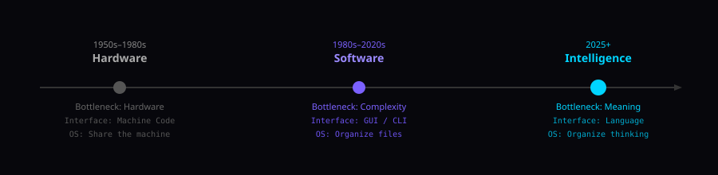
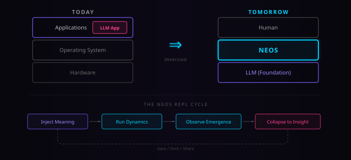
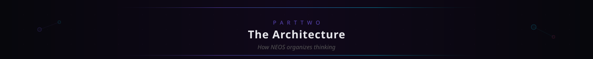
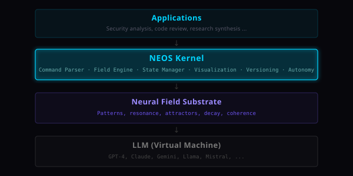
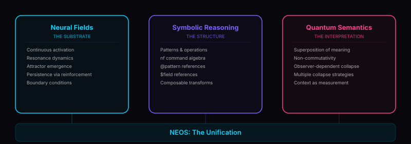
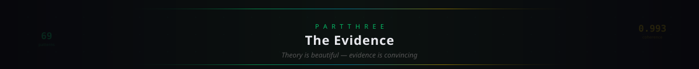
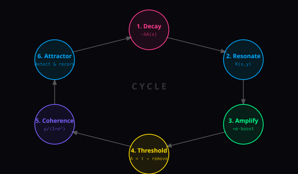
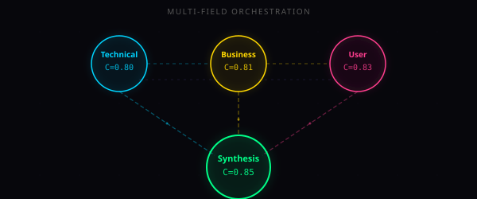
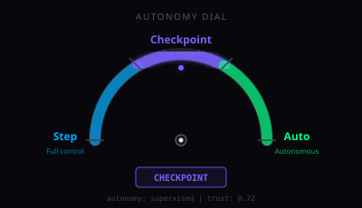

<div align="center">


[](.)
[](.)
[](.)

[](https://claude.ai/claude-code)
[](https://github.com/google-gemini/gemini-cli)
[-00b96b?style=flat-square)](https://github.com/opencode-ai/opencode)

**The first operating system where the machine is language and the substrate is meaning.**

> *"The last operating system will not manage files. It will manage meaning."*

[](https://samuele95.github.io/neos/neos-paper.pdf)
[](https://samuele95.github.io/neos/NEOS-BREAKTHROUGH.html)
[](https://samuele95.github.io/neos/NEOS-PRESENTATION.html)

[The Vision](#01--the-three-ages-of-computing) · [What It Is](#03--what-neos-is--today) · [What It Proved](#07--what-neos-proved) · [Commands](#13--command-reference)

</div>

---

<div align="center">

</div>

## 01 — The Three Ages of Computing

Computing has undergone two fundamental transitions. Each changed not just what we could do with machines, but how we *thought* about them. Now we are entering the third — and it will be the most profound of all.

<div align="center">

</div>

In the **Hardware Age**, the CPU was sacred. Operating systems were born to answer one question: *"How do we share this machine?"* Every cycle was a resource to be scheduled. Every byte was territory to be managed.

In the **Software Age**, hardware became abundant but complexity became the enemy. C, Java, Python — humans learned programming languages to organize millions of lines of code. Operating systems evolved to answer: *"How do we organize these programs?"*

Now the bottleneck has moved again. The challenge is no longer computing faster or organizing more code — it is organizing **thinking itself**. How do you represent an idea so it can interact with other ideas? How do you track which interpretations are gaining strength? How do you merge two lines of reasoning? How do you debug a thought?

These are the questions an OS for the Intelligence Age must answer. They are precisely the questions NEOS was designed to address.

> [!IMPORTANT]
> **We don't need a better programming language. We need to stop programming altogether — and start *reasoning*.** NEOS is the first operating system built for Age 3.

---

## 02 — The Vision: LLM as Universal OS

Today, Large Language Models are *applications* that run on an operating system — Windows, Linux, macOS. They are apps. Useful apps, even transformative apps. But still: apps.

**Tomorrow, the LLM *is* the operating system.** Every interaction with a computer will pass through language understanding. This is not speculation — it is the trajectory we are already on. And NEOS is the first specification for what that world looks like.

<div align="center">

</div>

Consider what this inversion means:

| Old World | New World |
|-----------|-----------|
| **File systems** organize by path | **Semantic fields** organize by meaning |
| **Compiled binaries** execute instructions | **Field configurations** execute reasoning |
| **Separate applications** for each task | **Task definitions** that compose into workflows |
| **GUIs** mediate between human and machine | **Natural language + shell** for precision and fluidity |

The NEOS shell — `nf` — is the **REPL of cognitive computing**. You don't write code — you inject meaning, run dynamics, observe emergence, and collapse to insight.

```
    Inject Meaning → Run Dynamics → Observe Emergence → Collapse to Insight
         ↑                                                       |
         └───────────── Save / Fork / Share ←────────────────────┘
```

> "Programs" in NEOS are not instruction sequences. They are **field configurations** — patterns with activation strengths, resonance relationships, and parameters. A program is a thought, formalized.

---

<div align="center">

</div>

## 03 — What NEOS Is — Today

NEOS v1.0 is a **specification** — 37 markdown files that define an interactive runtime environment running *on* an LLM. The LLM is the virtual machine. NEOS is the operating system. Neural fields are the computational substrate.

<div align="center">

</div>

At the heart of everything is the **master equation** — one formula that governs all dynamics:

```
∂A/∂t = -λA(x) + α∫K(x,y)A(y)dy + ι(x,t)
         ─┬──     ─────┬──────     ──┬──
          │             │             │
        Decay       Resonance     Injection
```

**In plain English:** Ideas decay if not reinforced, grow stronger when they resonate with others, and can be injected by the user at any time. That's it. From this single equation, *all* of NEOS emerges — attractors, coherence, collapse, versioning, multi-field orchestration.

| Term | What It Does | Intuition |
|------|-------------|-----------|
| **−λA(x)** | Exponential decay | Ideas fade unless reinforced — **forgetting is a feature, not a bug** |
| **α∫K(x,y)A(y)dy** | Resonance integral | Related ideas amplify each other — the "hearing" mechanism |
| **ι(x,t)** | External injection | You add new ideas via `nf inject` — fresh signal into the field |

### Parameters

| Symbol | Name | Default | Range | Effect |
|--------|------|---------|-------|--------|
| λ | Decay rate | 0.05 | 0.0–1.0 | Higher = faster forgetting, more selective field |
| α | Amplification | 0.30 | 0.0–1.0 | Higher = stronger resonance, faster convergence |
| τ | Threshold | 0.40 | 0.0–1.0 | Below this, patterns are marked dormant |
| σ | Bandwidth | 0.50 | 0.0–∞ | Semantic reach of each pattern's influence |

These four parameters define a **cognitive style**. A security analysis wants low λ (don't forget threats), high α (cluster related threats fast), high τ (only credible concerns survive). A creative brainstorm wants high λ (rapid turnover), moderate α, low τ (let weak ideas live). Same engine. Different cognitive personality. Tuned with four numbers.

---

## 04 — The Three Pillars

NEOS rests on a triple foundation. Each pillar is necessary; together they make cognitive computing possible. Remove any one and the system either cannot *represent* meaning, cannot *manipulate* it, or cannot *interpret* it.

<div align="center">

</div>

### Pillar 1: Neural Fields — Why Fields Beat Prompts

In a prompt, information persists only if you explicitly include it. Context window overflow destroys old information silently. In a neural field, information persists through **resonance** — if a pattern connects to others that keep it alive, it endures. Relationships emerge naturally from semantic proximity. New input interacts with the *entire* field, not just recent tokens.

### Pillar 2: Symbolic Reasoning — The Opcodes of Cognitive Computing

Without structure, fields are beautiful but unusable — like having a piano with no keys. The `nf` command set is a symbolic language for field manipulation: `inject`, `amplify`, `attenuate`, `collapse`. These are composable and algebraic: `amplify(@a, 1.5)` has a precise mathematical meaning in terms of the field equation.

### Pillar 3: Quantum Semantics — Observer-Dependent Collapse

Before collapse, meaning exists in **superposition**. The field holds multiple possible interpretations simultaneously. Injecting A then B is not the same as injecting B then A — order matters, because each injection alters the field that receives the next one. This is genuine **non-commutativity**, not metaphor.

When you run `nf collapse`, you force the superposition to resolve — like quantum measurement. The same field can collapse differently depending on strategy: `attractor`, `threshold`, `weighted`, `sample`. **The observer matters. The strategy you choose shapes the output you get.**

---

## 05 — The JVM Moment

In 1995, Java made a promise: **"Write once, run anywhere."** The JVM decoupled code from hardware.

NEOS makes a parallel promise: **"Think once, reason anywhere."** NEOS decouples reasoning from any specific LLM. You don't care whether the underlying model is GPT-4, Claude, Gemini, or Llama — NEOS abstracts the model away.

| JVM World | NEOS World | The Insight |
|-----------|-----------|-------------|
| Garbage Collection | Decay (λ) | Automatic cleanup of unreferenced objects / unreinforced patterns |
| Heap Memory | Field State | Where objects / patterns live and interact |
| Threads | Multi-Field | Concurrent execution contexts with shared state |
| Stack Trace | Cycle Trace | Debugging by tracing execution / dynamics history |
| ClassLoader | Pattern Injection | Loading new code / meaning into the runtime |
| JIT Compilation | Adaptive Resonance | Runtime optimization based on actual usage patterns |

> [!IMPORTANT]
> **But NEOS goes further.** The JVM abstracted *hardware*. NEOS abstracts **cognition itself**. The JVM still executed *code* — sequences of deterministic instructions. NEOS executes *meaning* — patterns that interact through resonance, self-organize into attractors, and collapse into insight. This is not a quantitative improvement. It is a qualitative shift in what "computation" means.

---

## 06 — The NEOS Shell

The NEOS shell is to cognitive computing what `bash` is to Unix. But instead of manipulating files and processes, it manipulates **meaning and reasoning**.

Think of it this way:

| Traditional Computing | NEOS |
|----------------------|------|
| **Create**: Write source code | **Inject**: `nf inject` seeds patterns into the field |
| **Compile**: Build executable | **Collapse**: `nf collapse` resolves superposition into structure |
| **Run**: Execute the program | **Task**: `nf task` executes against the crystallized field state |

The shell grammar is built on **imperative verbs** operating on **semantic objects**: `inject`, `amplify`, `cycle`, `collapse`, `commit`. Like any good shell, it supports **debugging** — but here you're debugging a *thought*:

```bash
# Set a breakpoint on coherence
> nf checkpoint "coherence > 0.8"

# Step through dynamics one phase at a time
> nf mode step
> nf cycle 1
  [STEP 1/4] Decay @security: 0.85 → 0.81
  [PAUSED] 'nf proceed' to continue...

# Inspect the full field state at any point
> nf state
```

> You can see *exactly* why an attractor formed, which resonance connections supported it, and why alternative interpretations were suppressed. No prompt chain, no agent framework, no current AI tool gives you this level of visibility into reasoning. **NEOS doesn't just produce answers — it shows you how they were constructed.**

---

<div align="center">

</div>

## 07 — What NEOS Proved

> [!IMPORTANT]
> **There is nothing to install.** NEOS runs entirely inside an LLM's context window. No packages, no dependencies, no runtime. Copy the [kernel prompt](prompts/nfos-kernel.md), paste it as a system prompt, and type your first command.

To test whether NEOS can discover genuine structure from raw material, we ran a session called `software_quality_discipline` — a deliberate stress test. The question: *if you feed a neural field dozens of software engineering patterns, does it find coherent principles, or just echo what you put in?*

We injected **69 patterns** across 7 waves — from code review basics through SOLID, GoF, and reuse strategies. Over **52 cycles** of resonance dynamics, the field self-organized: absorbing redundancies, expelling incompatibilities, and discovering structure no single injection contained. From those 69 inputs, it distilled **5 eigenvectors**, **7 attractor basins**, **1 universal invariant**, and **1 expulsion** — none of which were injected. They emerged.

> 📊 *The complete wave-by-wave walkthrough — every injection, resonance matrix, absorption, and the 21-cycle drama of Singleton's expulsion — is in **[The Session: Complete Evidence](SESSION_EVIDENCE.md)**. The [visual evidence companion](sessions/visual-evidence.md) has the diagrams.*

**Session roadmap** — coherence at each milestone:

| Wave | Patterns | Cycles | Coherence | Key Event |
|------|----------|--------|-----------|-----------|
| Setup | — | 0 | 0.00 | Field created, parameters tuned |
| 1. Review | p001–p006 | 1–3 | 0.00 → **0.71** | `defensive_quality` attractor emerges |
| 2. Breadth | p007–p014 | 4–8 | 0.52 → **0.79** | `holistic_quality_discipline` attractor |
| 3. Refactoring | p015–p022 | 9–11 | 0.62 → **0.80** | Attractor → MATURE, R=0.94 bond |
| 4. Testing | p023–p031 | 12–18 | 0.64 → **0.91** | Functor F discovered, mass saturation |
| 5. OOP/SOLID | p032–p040 | 19–30 | 0.89 → **0.955** | 3 absorptions, SOLID Decagon |
| — Singleton — | p044 | 30 | 0.955 → **0.941** | Immune response, 4 inhibitors |
| 6. GoF | p046–p055 | 34–43 | 0.962 → **0.984** | Great Convergence, Golden Pair |
| 7. Reuse | p056–p062 | 44–49 | — → **0.990** | 4 self-referential absorptions |
| Collapse | — | 50–52 | 0.990 → **0.993** | Singleton expelled, ground state |

### The Discoveries

**Five eigenvectors** decompose the entire quality space:

| # | Eigenvector | Variance | Diagnostic Question |
|---|-------------|----------|---------------------|
| λ₁ | **Meaning ↔ Mechanism** | **34.2%** | Am I coupling to WHAT this does or HOW it does it? |
| λ₂ | Principle ↔ Technique | 22.7% | Do I understand WHY before choosing HOW? |
| λ₃ | Production ↔ Verification | 18.1% | Can I prove this works as well as I can build it? |
| λ₄ | Restraint ↔ Generalization | 14.3% | Is this abstraction earned or speculative? |
| λ₅ | Class ↔ System | 10.7% | Does this principle hold at every scale? |

**Seven attractor basins** organize the surviving patterns:

| Basin | Name | Depth | Patterns | Role |
|-------|------|-------|----------|------|
| **Ψ** | Universal Attractor | ground | ALL | Meaning > Mechanism |
| α₁ | SOLID Decagon | primary | 10 | Amplification engine |
| α₂ | Verification Mirror | primary | 13 | Reflection functor F |
| α₃ | Craft Basin | secondary | 12 | GoF patterns (Singleton expelled) |
| α₄ | Reuse Protocol | secondary | 9 | Abstraction discipline |
| α₅ | Guard Basin | tertiary | 3 | Boundary defense |
| α₆ | Model Basin | tertiary | 2 | Domain modeling |
| α₇ | Optimize Basin | tertiary | 2 | Performance satellites |

**One field equation** composes the eigenvectors into a predictive quality assessment:

```
    Q(x) = Ψ · [ 0.342·SOLID(x) + 0.227·F(x) + 0.181·Protocol(x)
                  + 0.143·Simplex(x) + 0.107·Scale(x) ]

    Where Ψ = "judge by meaning, not mechanism"
    Σα = 1.000 | R_pt = 0.88 | r(SOLID,speed) = 0.94
```

**One universal invariant** — the ground state from which no further relaxation is possible:

> **Ψ: "What something MEANS persists; how it WORKS changes."**

It was not injected. It emerged. Three equivalent forms discovered by the field:

| Form | Expression |
|------|-----------|
| **Logic** | Depend on abstractions over implementations |
| **Structure** | Stable interfaces over volatile implementations |
| **Testing** | Test behavior over implementation details |

The field applied Ψ to *itself* — four times the absorption of a new pattern reproduced the existing field unchanged (Ψ(field) = field). This fixed-point property confirms Ψ as the true ground state.

```
    Patterns:     61 stable  (69 attempted, 7 absorbed, 1 expelled)
    Coherence:    0.993
    Eigenvectors: 5 (100% variance explained)
    Absorptions:  7 (57% self-referential)
    Expulsions:   1 (singleton — field's immune response)
    Functor:      16 mappings, η = dependency injection
    Ground state: Ψ — "meaning persists, mechanism changes"
    Cycles:       52 │ Status: COLLAPSED
```

> 📊 *Full analysis: **[The Session: Complete Evidence](SESSION_EVIDENCE.md)** · [Visual Evidence](sessions/visual-evidence.md)*

---

## 08 — The Dynamics Engine

Every `nf cycle` executes six phases. This is the **heartbeat of NEOS** — the engine that transforms injected patterns into emergent structure.

<div align="center">

</div>

| Phase | What Happens |
|-------|-------------|
| **① Decay** | Every pattern loses activation: `A ← A × (1 − λ)`. Ideas that nothing reinforces will fade. |
| **② Resonate** | Compute pairwise resonance across semantic, logical, and contextual dimensions. |
| **③ Amplify** | Patterns with strong resonance gain activation: `A ← A + α × Σ(R·A)`. Mutual reinforcement. |
| **④ Threshold** | Patterns below τ are marked dormant — they stop participating but aren't deleted. |
| **⑤ Coherence** | Measure field-wide consistency: `C = μ_R / (1 + σ²_R)`. High mean resonance + low variance = coherence. |
| **⑥ Attractor** | Test for emergence: coherence > 0.6 ∧ energy concentrated > 70% ∧ perturbation-stable → attractor declared. |

> Every insight, every conclusion, every finding emerges from this cycle repeating until the field settles into stable attractors. This is not an algorithm we designed to find answers. It is a **dynamics** that *discovers* them.

---

## 09 — Multi-Field Orchestration

A single field is powerful. Multiple coupled fields are transformative. Different fields represent different perspectives — technical, user, business — coupled through a resonance matrix that lets them influence each other.

<div align="center">

</div>

Two orchestration modes:

| Mode | How It Works | Analogy |
|------|-------------|---------|
| **Pipeline** | Field A's collapsed output feeds into Field B | Unix pipe for reasoning |
| **Parallel** | All fields process the same input, results fuse via resonance | Panel of experts debating |

```bash
> nf field create perception --params "lambda=0.03"
[FIELD] Created: perception (λ=0.03, slow decay — long memory)

> nf field create reasoning --params "lambda=0.08"
[FIELD] Created: reasoning (λ=0.08, fast decay — selective)

> nf couple $perception $reasoning --gamma 0.4
[COUPLE] perception ↔ reasoning (γ=0.4)

> nf cycle 5
[CYCLE 1] (multi-field)
  Cross-field transfer: perception → reasoning (0.35)
```

> In today's agent frameworks, agents coordinate through message passing — one sends text to another, losing all nuance. In NEOS, agents share *resonance*. Conflicts are visible as low cross-field resonance scores. The system quantifies agreement and disagreement, enabling principled arbitration rather than crude majority voting.

---

## 10 — The Autonomy Dial

How much should the system think on its own? This is not a binary choice. NEOS provides a **continuously adjustable spectrum**.

<div align="center">

</div>

| Mode | When To Use | Terminal Example |
|------|------------|-----------------|
| **Step** | Learning, debugging, precise experiments | `nf mode step` → pauses after each decay, each resonance |
| **Checkpoint** | Interactive analysis, quality control | `nf checkpoint "coherence > 0.8"` → runs freely until condition met |
| **Auto** | Batch processing, trusted configurations | `nf task "Analyze security vulnerabilities"` → runs to completion |

You can switch modes mid-operation. Start in auto, notice something interesting, switch to checkpoint to investigate, then step through a few cycles manually. The dial is always accessible.

> **Not a binary switch — a continuously adjustable dial.** The same field configuration can be operated at any autonomy level without modification. This is the NEOS answer to the AI alignment question at the practical level: not a fixed policy, but a control that the human operator holds at all times.

---

## 11 — Observable Reasoning

> **The most dangerous property of current AI is opacity.** An agent makes a decision and you cannot see *why*. NEOS makes reasoning **visible**.

Four visualization types capture different aspects of the field:

| Command | What You See | Purpose |
|---------|-------------|---------|
| `nf plot field` | Activation bar chart | Which ideas are strongest right now |
| `nf plot network` | Resonance graph | How ideas connect and reinforce each other |
| `nf plot topology` | Attractor landscape | Where the "valleys" of stable meaning are |
| `nf animate dynamics` | Evolution across cycles | How ideas competed, clustered, and crystallized |

```bash
# "Debugging a thought"
> nf mode step
> nf cycle 1
  [STEP 1/6] Decay: @security 0.85 → 0.81
  [PAUSED]
> nf proceed
  [STEP 2/6] Resonance: (@security, @validation) = 0.72
  [PAUSED]
# You can see EXACTLY why an attractor formed
```

Outputs render in four formats: **ASCII** (terminal), **SVG** (visual), **Mermaid** (diagramming), **JSON** (programmatic). Reasoning is not just visible — it is exportable, shareable, and integrable.

> Debugging agents is currently impossible. When an AI agent makes a bad decision, there is no stack trace, no debugger, no step-through execution for reasoning. **NEOS makes reasoning observable and reproducible.** This alone may be its most practical near-term contribution.

---

## 12 — Why Now

NEOS is buildable *today* because four independent developments have converged simultaneously — and their intersection creates an opening that didn't exist even two years ago.

| Convergence | What Changed |
|-------------|-------------|
| **LLM Capability Threshold** | Models can now maintain complex state, reason about abstract structures, and generate formal outputs reliably enough to serve as a computational substrate |
| **Agent Fragmentation** | AutoGPT, CrewAI, LangGraph, LlamaIndex — dozens of frameworks, each reinventing state management, coordination, memory. They're all building pieces of an OS without knowing it |
| **Prompt Engineering Ceiling** | You can only get so far by carefully wording text. Prompts are the assembly language of the Intelligence Age; NEOS is the high-level language |
| **Open-Weight Models** | Llama, Mistral, and others mean NEOS isn't locked to any vendor. "Think once, reason anywhere" is achievable because the VM layer is genuinely diverse |

> [!TIP]
> **The fifth convergence:** Debugging agents is currently impossible. When an AI agent makes a bad decision, you cannot trace *why*. NEOS makes reasoning **observable and reproducible**. You can watch coherence form, trace resonance paths, step through dynamics cycle by cycle.

---

<div align="center">

</div>

## 13 — Command Reference

NEOS provides ~40 commands organized into 8 categories. Each section is collapsible — expand what you need.

<details>
<summary><strong>Field Operations</strong> — inject, amplify, attenuate, tune, collapse, resonate</summary>

| Command | Description |
|---------|-------------|
| `nf inject "<pattern>" [strength]` | Add a pattern to the active field (default strength: 0.5) |
| `nf amplify @pattern [factor]` | Increase pattern activation by factor (default: 1.5) |
| `nf attenuate @pattern [factor]` | Decrease pattern activation by factor (default: 0.5) |
| `nf remove @pattern` | Remove a pattern from the field entirely |
| `nf tune <param>=<value>` | Adjust field parameters (λ, α, τ, σ) |
| `nf collapse [--strategy s]` | Generate structured output from field state |
| `nf resonate [@p1 @p2]` | Compute resonance between two patterns (or all pairs) |

**Collapse strategies:** `attractor` (default), `threshold`, `weighted`, `sample`

</details>

<details>
<summary><strong>Dynamics</strong> — cycle, evolve, step, reset</summary>

| Command | Description |
|---------|-------------|
| `nf cycle [n] [--trace]` | Run n dynamics cycles (default: 1). `--trace` shows all phases. |
| `nf evolve [--target <coherence>]` | Evolve continuously until target coherence is reached |
| `nf step` | Execute a single atomic micro-step (one phase of one cycle) |
| `nf reset [--preserve @p]` | Clear field state. `--preserve` keeps specified patterns. |

</details>

<details>
<summary><strong>Measurement</strong> — measure, attractor, basin, state</summary>

| Command | Description |
|---------|-------------|
| `nf measure coherence` | Current field coherence value (0–1) |
| `nf measure energy` | Energy distribution across patterns |
| `nf attractor list` | List all emerged attractors with coherence scores |
| `nf attractor info <name>` | Detailed attractor breakdown — core patterns, basin, stability |
| `nf basin @attractor [--map]` | Analyze the attractor's basin of attraction |
| `nf state [--json]` | Full field state dump |

</details>

<details>
<summary><strong>Visualization</strong> — plot, animate, export</summary>

| Command | Description |
|---------|-------------|
| `nf plot field [--style ascii]` | Field state visualization (activation bars) |
| `nf plot network` | Resonance network graph (Mermaid diagram) |
| `nf plot topology [--3d]` | Attractor landscape / energy surface |
| `nf animate dynamics` | Animated evolution across cycles |
| `nf export <format>` | Export visualization (svg, json, mermaid) |

</details>

<details>
<summary><strong>Versioning</strong> — commit, branch, checkout, history, diff, merge</summary>

| Command | Description |
|---------|-------------|
| `nf commit [message]` | Save a state snapshot with message |
| `nf branch create <name>` | Create a new branch from current state |
| `nf branch list` | List all branches |
| `nf checkout <ref>` | Restore state from commit hash or branch name |
| `nf history [--graph]` | Show commit history. `--graph` shows branch structure. |
| `nf diff [ref1] [ref2]` | Compare two states — pattern changes, coherence delta |
| `nf merge <branch>` | Merge another branch's patterns into current field |

</details>

<details>
<summary><strong>Multi-Field</strong> — field, route, couple</summary>

| Command | Description |
|---------|-------------|
| `nf field create <name> [--params]` | Create a new named field with optional parameters |
| `nf field list` | List all fields and their status |
| `nf field activate $field` | Switch the active field |
| `nf field delete $field` | Delete a field |
| `nf route $src $dest` | Create a directional connection between fields |
| `nf couple $f1 $f2 [--gamma γ]` | Set bidirectional coupling strength between fields |

</details>

<details>
<summary><strong>Autonomy</strong> — mode, checkpoint, proceed, task</summary>

| Command | Description |
|---------|-------------|
| `nf mode step` | Pause after every atomic operation |
| `nf mode checkpoint` | Pause only at defined conditions |
| `nf mode auto` | Run to completion without pausing |
| `nf checkpoint "<condition>"` | Add a pause condition (e.g., `"coherence > 0.8"`) |
| `nf checkpoint list` | List active checkpoint conditions |
| `nf proceed [n]` | Continue execution (optionally for n steps) |
| `nf task "<description>"` | Define a task for autonomous execution |

</details>

<details>
<summary><strong>Interface & Config</strong> — config, ask, compute, help</summary>

| Command | Description |
|---------|-------------|
| `nf config interface <mode>` | Switch interface mode: `semantic`, `algebraic`, `geometric` |
| `nf config set <key> <value>` | Set a configuration value |
| `nf ask "<question>"` | Natural language query about the field state |
| `nf compute <expression>` | Algebraic computation (e.g., `R(@p1, @p2)`) |
| `nf help [command]` | Show help for a specific command or general reference |

</details>

<details>
<summary><strong>Quick Reference Card</strong></summary>

```
CORE                          DYNAMICS
────────────────────────────  ────────────────────────────
nf inject "p" [s]             nf cycle [n] [--trace]
nf amplify @p [f]             nf evolve [--target c]
nf attenuate @p [f]           nf step
nf tune λ=v α=v               nf reset [--preserve @p]
nf collapse [--strategy s]

MEASUREMENT                   VISUALIZATION
────────────────────────────  ────────────────────────────
nf measure coherence          nf plot field [--3d]
nf measure energy             nf plot network
nf attractor list             nf plot topology
nf basin @a [--map]           nf animate dynamics
nf state                      nf export <fmt>

VERSIONING                    AUTONOMY
────────────────────────────  ────────────────────────────
nf commit [msg]               nf mode step|checkpoint|auto
nf branch create <n>          nf checkpoint "<cond>"
nf checkout <ref>             nf proceed [n]
nf history [--graph]          nf task "<desc>"
nf diff [r1] [r2]

FIELDS                        INTERFACE
────────────────────────────  ────────────────────────────
nf field create <n>           nf config interface <m>
nf field list                 nf ask "<question>"
nf route $a $b                nf compute <expr>
nf couple $a $b [--γ]         nf help [cmd]
```

**Reference syntax:** `@name` = pattern, `$name` = field, `#hash` = commit, `~n` = relative commit

</details>

---

## 14 — Project Structure

```
neos/
├── README.md                    ← You are here
├── NEOS-BREAKTHROUGH.html       ← Research paper — the theoretical foundations
├── NEOS-PRESENTATION.html       ← Visual overview
├── prompts/
│   └── nfos-kernel.md           ← System prompt — the "bootloader"
├── core/
│   ├── field-engine.md          ← Dynamics processor & attractor detector
│   ├── command-parser.md        ← Command syntax & parsing rules
│   └── state-manager.md         ← State persistence & versioning
├── commands/
│   ├── index.md                 ← Full command reference (~40 commands)
│   ├── field-ops.md             ← inject, amplify, attenuate, collapse
│   ├── dynamics.md              ← cycle, evolve, step, reset
│   ├── measurement.md           ← measure, attractor, basin, state
│   ├── visualization.md         ← plot, animate, export
│   ├── versioning.md            ← commit, branch, checkout, diff
│   ├── field-mgmt.md            ← field create, route, couple
│   └── autonomy.md              ← mode, checkpoint, proceed, task
├── autonomy/
│   ├── modes.md                 ← Step / Checkpoint / Auto specs
│   ├── checkpoints.md           ← Condition language
│   └── tasks.md                 ← Autonomous task definitions
├── visualization/
│   ├── topology.md              ← Attractor landscapes
│   ├── networks.md              ← Resonance network graphs
│   ├── dynamics-animation.md    ← Animated evolution
│   └── generators/              ← ASCII, SVG, Mermaid, Plotly
├── interfaces/
│   ├── semantic.md              ← Natural language interface
│   ├── algebraic.md             ← Mathematical notation interface
│   └── translation.md           ← Cross-interface translation
├── persistence/
│   ├── format-spec.md           ← State serialization format
│   ├── storage-engine.md        ← Storage backend spec
│   └── versioning.md            ← Git-like versioning internals
├── sessions/
│   ├── software_quality_discipline.collapsed.md  ← Case study
│   └── visual-evidence.md                        ← Diagram gallery for §07
└── examples/
    ├── 01-basic-session.md      ← Beginner walkthrough
    ├── 02-versioning.md         ← Branch & merge workflows
    ├── 03-visualization.md      ← Visualization deep-dive
    ├── 04-multi-field.md        ← Multi-field orchestration
    └── 05-autonomous.md         ← Autonomous task execution
```

| Framework Component | NEOS Usage |
|---------------------|------------|
| `foundations/05-operations.md` | Core operation definitions (inject, amplify, attenuate) |
| `foundations/04-attractors.md` | Attractor detection and basin analysis algorithms |
| `templates/system/neural-field-reasoner.md` | Base architecture for the NEOS kernel prompt |
| `templates/meta/dynamics-execution.md` | Cycle execution and phase sequencing |

---

## 15 — The Future: Join the Intelligence Age

We are at the beginning of a transition as profound as the invention of the operating system itself. The Hardware Age gave us the ability to compute. The Software Age gave us the ability to organize. The Intelligence Age will give us the ability to **reason** — systematically, observably, reproducibly.

NEOS is the first step. Not the last.

The specification is open. The math is grounded. The proof-of-concept works. What remains is to build the community, iterate the specification, and push toward implementation — turning 37 markdown files into the foundation of a new computing paradigm.

> [!IMPORTANT]
> **Getting started takes 30 seconds.** Copy the [kernel prompt](prompts/nfos-kernel.md), paste it as a system prompt, and type `nf session new "My First Analysis"`. No install. No dependencies. The LLM *is* the machine.
>
> **Successfully tested with:** Claude Code, Gemini CLI, and OpenCode (Minimax model from OpenCode Zen).

### Links

| Resource | Description |
|----------|-------------|
| [NEOS Paper (PDF)](https://samuele95.github.io/neos/neos-paper.pdf) | Formal paper (ICLR-style) |
| [NEOS Website](https://samuele95.github.io/neos/NEOS-BREAKTHROUGH.html) | Interactive HTML paper |
| [NEOS Presentation](https://samuele95.github.io/neos/NEOS-PRESENTATION.html) | Visual overview |
| [Kernel Prompt](prompts/nfos-kernel.md) | The system prompt that boots NEOS inside an LLM |
| [Full Command Reference](commands/index.md) | Detailed specs for all ~40 commands |
| [Basic Session Walkthrough](examples/01-basic-session.md) | Extended tutorial with 11 steps |
| [Case Study](sessions/software_quality_discipline.collapsed.md) | The software quality session data |
| [Visual Evidence](sessions/visual-evidence.md) | Diagram gallery — attractors, flowcharts, landscapes |

---

<div align="center">

</div>
