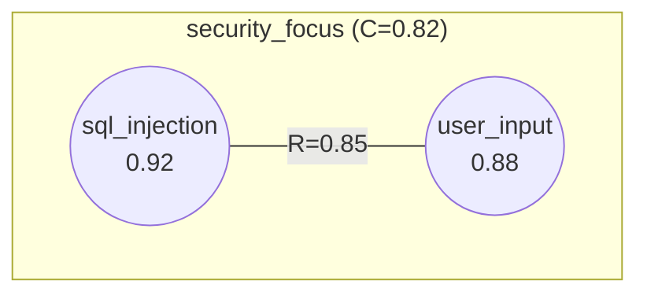

# Visualization Commands

Commands for generating visual representations: plot, animate, and export.

---

## 1. Plot

Generates static visualizations of field state.

### Syntax

```
nf plot <type> [--flags]
```

### Plot Types

| Type | Description |
|------|-------------|
| `field` | Activation distribution |
| `network` | Resonance graph |
| `topology` | Energy landscape |
| `basins` | Basin of attraction map |
| `flow` | Dynamics trajectories |
| `matrix` | Resonance matrix |

---

### 1.1 Plot Field

Visualizes pattern activations.

```
nf plot field [--style <s>] [--flags]
```

**Styles:**
| Style | Description |
|-------|-------------|
| `bar` | Horizontal bar chart (default) |
| `heatmap` | 2D activation grid |
| `pie` | Activation distribution |

**Flags:**
| Flag | Description |
|------|-------------|
| `--sort` | Sort by activation |
| `--threshold <t>` | Only show above threshold |

**Output:**
```
[FIELD] main (Coherence: 0.78)

sql_injection   │████████████████████████████████████ 0.92
user_input      │█████████████████████████████████  0.88
validation      │████████████████████████████     0.75
logging         │██████████████                   0.35
                └────────────────────────────────────
                0.0              0.5              1.0
```

---

### 1.2 Plot Network

Visualizes resonance relationships.

```
nf plot network [--flags]
```

**Flags:**
| Flag | Type | Default | Description |
|------|------|---------|-------------|
| `--threshold <t>` | float | 0.2 | Min resonance to show |
| `--layout <l>` | string | force | Layout algorithm |
| `--labels` | bool | true | Show pattern names |
| `--weights` | bool | false | Show R values |
| `--3d` | bool | false | 3D visualization |

**Layouts:**
| Layout | Description |
|--------|-------------|
| `force` | Force-directed (default) |
| `semantic` | Based on pattern positions |
| `hierarchical` | Attractor hierarchy |
| `circular` | Circular arrangement |

**Output (ASCII):**
```
[NETWORK] Field: main (threshold: 0.4)

    ┌──────────┐             ┌─────────┐
    │ security │═════════════│  input  │
    │   0.92   │   R=0.85    │  0.88   │
    └────┬─────┘             └────┬────┘
         │                        │
         └────────────┬───────────┘
                 ┌────┴────┐
                 │  valid  │
                 │  0.75   │
                 └─────────┘
```

**Output (Mermaid):**


---

### 1.3 Plot Topology

Visualizes energy landscape with attractors.

```
nf plot topology [--style <s>] [--flags]
```

**Styles:**
| Style | Description |
|-------|-------------|
| `contour` | 2D contour lines |
| `heatmap` | 2D color gradient |
| `surface` | 3D surface (requires --3d) |
| `wireframe` | 3D wireframe |

**Flags:**
| Flag | Type | Default | Description |
|------|------|---------|-------------|
| `--3d` | bool | false | 3D visualization |
| `--resolution <n>` | int | 50 | Grid resolution |
| `--show-attractors` | bool | true | Mark attractors |

**Output:**
```
[TOPOLOGY] Field: main

    ┌────────────────────────────────────────────┐
 1.0│  ·    ·    ·    ·    ·    ·    ·    ·     │
    │     ╭─────────────╮           ╭───╮       │
 0.8│   ╭─┤    Basin    ├─╮       ╭─┤ B │       │
    │  ╭┤ │      A      │ ├╮     ╭┤ │   │       │
 0.6│  ││ │     ●       │ ││     ││ │ ● │       │
    │  ╰┤ │   (0.82)    │ ├╯     ╰┤ │   │       │
 0.4│   ╰─┤             ├─╯       ╰─┤   │       │
    │     ╰─────────────╯           ╰───╯       │
 0.2│  ·    ·    ·    ·    ·    ·    ·    ·     │
 0.0└────────────────────────────────────────────┘
```

---

### 1.4 Plot Basins

Visualizes attractor basins.

```
nf plot basins [--attractor <name>]
```

**Output:**
```
[BASINS] Field: main

    ┌────────────────────────────────────────────┐
 1.0│ · · · · · · · · · · · · · · · · · · · · · │
    │ · · · · · · · · · · · · · · · B B B · · · │
 0.8│ · · · A A A A A A · · · · · B B B B · · · │
    │ · · A A A A A A A A · · · B B B B · · · · │
 0.6│ · · A A A A●A A A A · · · · B●B · · · · · │
    │ · · A A A A A A A A · · · B B B B · · · · │
 0.4│ · · · A A A A A A · · · · · B B B · · · · │
    │ · · · · · · · · · · · · · · · · · · · · · │
 0.2│ · · · · · · · · · · · · · · · · · · · · · │
 0.0└────────────────────────────────────────────┘

  A = security_focus (65%)
  B = logging_concern (25%)
```

---

### 1.5 Plot Flow

Visualizes dynamics trajectories.

```
nf plot flow [--from @pattern] [--steps <n>]
```

**Output:**
```
[FLOW] From @new_pattern

  Start → → → → ↘
                  ↘
                   ↘ → → ● security_focus
                  ↗
              ↗ ↗
```

---

### 1.6 Plot Matrix

Visualizes resonance matrix.

```
nf plot matrix [--format <f>]
```

**Output:**
```
[RESONANCE MATRIX]
              sql    input  valid  log
sql          1.00    0.85   0.78   0.25
input        0.85    1.00   0.72   0.30
valid        0.78    0.72   1.00   0.22
log          0.25    0.30   0.22   1.00
```

---

## 2. Animate

Generates animated visualizations.

### Syntax

```
nf animate <type> [--flags]
```

### Animation Types

| Type | Description |
|------|-------------|
| `dynamics` | Field evolution over cycles |
| `network` | Network structure forming |
| `attractor` | Attractor emergence |
| `flow` | Pattern trajectories |

---

### 2.1 Animate Dynamics

Shows field evolution.

```
nf animate dynamics [--cycles n] [--fps f]
```

**Flags:**
| Flag | Type | Default | Description |
|------|------|---------|-------------|
| `--cycles <n>` | int | 10 | Number of cycles |
| `--fps <f>` | int | 10 | Frames per second |
| `--style <s>` | string | field | Visualization style |
| `--output <file>` | string | none | Save to file |

**Styles:**
| Style | Description |
|-------|-------------|
| `field` | Bar chart animation |
| `network` | Network evolution |
| `topology` | Energy surface changes |

**Terminal Output:**
```
╔══════════════════════════════════════════════════════════════╗
║ Cycle: 3/10                          Coherence: 0.72         ║
╠══════════════════════════════════════════════════════════════╣
║                                                              ║
║  sql_injection │████████████████████████████████ 0.89        ║
║  user_input    │█████████████████████████████  0.85          ║
║  validation    │██████████████████████████   0.78            ║
║  logging       │██████████                   0.38            ║
║                                                              ║
╠══════════════════════════════════════════════════════════════╣
║ [Space] Pause  [←/→] Step  [Q] Quit                         ║
╚══════════════════════════════════════════════════════════════╝
```

---

### 2.2 Animate Network

Shows network forming.

```
nf animate network [--cycles n]
```

---

### 2.3 Animate Attractor

Shows attractor emergence.

```
nf animate attractor [--name <name>]
```

---

## 3. Export

Exports visualizations to files.

### Syntax

```
nf export <format> [filename] [--flags]
```

### Formats

| Format | Extension | Description |
|--------|-----------|-------------|
| `ascii` | `.txt` | Plain text |
| `svg` | `.svg` | Vector graphics |
| `mermaid` | `.md` | Mermaid diagram |
| `plotly` | `.html` | Interactive HTML |
| `json` | `.json` | Data export |
| `png` | `.png` | Static image |
| `gif` | `.gif` | Animation |
| `mp4` | `.mp4` | Video |

### Examples

```bash
# Export network as SVG
> nf export svg network.svg
[EXPORT] Saved network visualization to network.svg

# Export as Mermaid in Markdown
> nf export mermaid network.md --wrap markdown
[EXPORT] Saved Mermaid diagram to network.md

# Export interactive Plotly
> nf export plotly topology.html --3d
[EXPORT] Saved interactive 3D plot to topology.html

# Export animation as GIF
> nf animate dynamics --cycles 10
> nf export gif evolution.gif
[EXPORT] Saved animation to evolution.gif (450 KB)

# Export data as JSON
> nf export json state.json
[EXPORT] Saved field data to state.json
```

---

## 4. Format Options

### 4.1 ASCII Options

```bash
nf plot network --format ascii --width 80 --color
```

| Option | Description |
|--------|-------------|
| `--width <n>` | Terminal width |
| `--height <n>` | Terminal height |
| `--color` | Enable ANSI colors |
| `--simple` | Use basic characters |

### 4.2 SVG Options

```bash
nf plot network --format svg --output net.svg --width 800 --height 600
```

| Option | Description |
|--------|-------------|
| `--width <n>` | Image width |
| `--height <n>` | Image height |
| `--style <s>` | CSS style preset |
| `--animate` | Include SMIL animations |

### 4.3 Mermaid Options

```bash
nf plot network --format mermaid --direction LR
```

| Option | Description |
|--------|-------------|
| `--direction <d>` | TB, BT, LR, RL |
| `--wrap <w>` | markdown, html, none |

### 4.4 Plotly Options

```bash
nf plot topology --format plotly --3d --output topo.html
```

| Option | Description |
|--------|-------------|
| `--3d` | 3D visualization |
| `--offline` | Embed Plotly.js |
| `--resolution <n>` | Surface resolution |

---

## 5. Quick Reference

```
PLOT COMMANDS                  OUTPUT FORMATS
────────────────────────────── ──────────────────────────────
nf plot field                  --format ascii  (default)
nf plot network                --format svg
nf plot topology               --format mermaid
nf plot basins                 --format plotly
nf plot flow                   --format json
nf plot matrix

ANIMATION COMMANDS             EXPORT COMMANDS
────────────────────────────── ──────────────────────────────
nf animate dynamics            nf export svg <file>
nf animate network             nf export mermaid <file>
nf animate attractor           nf export plotly <file>
nf animate flow                nf export gif <file>
                               nf export json <file>

COMMON FLAGS
──────────────────────────────
--output <file>    Save to file
--3d               3D visualization
--threshold <t>    Filter threshold
--style <s>        Visual style
--labels           Show labels
```

---

## 6. Examples

### 6.1 Quick Network View

```bash
> nf plot network
[NETWORK] Field: main (4 patterns, 6 edges)
[ASCII visualization displayed]
```

### 6.2 Export for Documentation

```bash
> nf plot network --format mermaid --wrap markdown > docs/network.md
[EXPORT] Mermaid diagram written
```

### 6.3 Interactive Exploration

```bash
> nf plot topology --3d --format plotly --output explore.html
[EXPORT] Interactive 3D plot saved
  Open explore.html in browser to interact
```

### 6.4 Animation Recording

```bash
> nf animate dynamics --cycles 10 --output evolution.gif
[ANIMATION] Recording 10 cycles...
  Frames: 100
  Duration: 10s
  Saved: evolution.gif (1.2 MB)
```

---

## Related Documents

- `../visualization/topology.md` - Topology visualization
- `../visualization/networks.md` - Network visualization
- `../visualization/dynamics-animation.md` - Animation specs
- `../visualization/generators/` - Format generators
