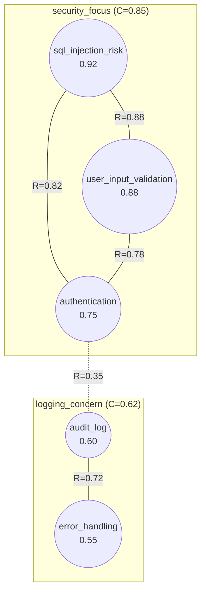

# NEOS Detailed Guide

> [Back to README](../README.md) · [Quick Start](../README.md#03--quick-start)

A comprehensive reference for every NEOS command, with examples and expected output.

---

## Table of Contents

[1. Prerequisites](#1-prerequisites) · [2. Session Management](#2-session-management) · [3. Field Operations](#3-field-operations) · [4. Dynamics Control](#4-dynamics-control) · [5. Measurement](#5-measurement) · [6. Visualization](#6-visualization) · [7. Versioning](#7-versioning) · [8. Multi-Field Orchestration](#8-multi-field-orchestration) · [9. Autonomy & Tasks](#9-autonomy--tasks) · [10. Interface & Configuration](#10-interface--configuration) · [11. Parameter Tuning Guide](#11-parameter-tuning-guide) · [12. Tips and Best Practices](#12-tips-and-best-practices)

---

## 1. Prerequisites

NEOS runs entirely inside an LLM's context window. There is nothing to install -- no packages, no dependencies, no runtime. The LLM is the virtual machine.

**Setup in three steps:**

1. Open the kernel prompt file at `prompts/nfos-kernel.md` in this repository.
2. Copy its full contents.
3. Paste it as the **system prompt** (or system instruction) in any LLM interface that supports one.

That is the entire installation process. Once the kernel prompt is loaded, the LLM becomes a NEOS runtime and you can start typing `nf` commands.

**Tested with:**
- **Claude Code** (Anthropic) -- primary development environment
- **Gemini CLI** (Google) -- confirmed compatible
- **OpenCode with Minimax** (OpenCode Zen) -- confirmed compatible

**Reference syntax used throughout this guide:**

| Syntax | Meaning | Example |
|--------|---------|---------|
| `@name` | Pattern reference | `@security_concern` |
| `$name` | Field reference | `$reasoning` |
| `#hash` | Commit reference | `#a1b2c3d` |
| `~n` | Relative commit | `~1` (previous), `~3` (3 ago) |

**The master equation governing all dynamics:**

```
dA/dt = -lambda * A(x) + alpha * integral K(x,y) * A(y) dy + iota(x,t)
         ----            -------                              ----
         Decay           Resonance                            Injection
```

**Default parameters:** lambda=0.05, alpha=0.30, tau=0.40, sigma=0.50

---

## 2. Session Management

Five commands for creating, saving, loading, inspecting, and exporting sessions.

### `nf session new "<name>"`

Create a new named session with a default field.

**Syntax:** `nf session new "<name>"`

```
> nf session new "Startup Analysis"
[SESSION] Created: Startup Analysis
  Field: main (default)
  Parameters: lambda=0.05, alpha=0.30, tau=0.40, sigma=0.50
  Mode: step (interactive)
```

> [!TIP]
> Every session starts with a single field called `main` and the default parameter set. You can tune parameters immediately with `nf tune` before injecting any patterns.

---

### `nf session save [file]`

Persist the current session state to a named file.

**Syntax:** `nf session save [file]`

```
> nf session save "startup_v1"
[SESSION] Saved: startup_v1
  Fields: 1
  Patterns: 8
  Commits: 3
  Format: nfos-session-v1
```

> [!NOTE]
> If no filename is given, NEOS auto-generates one from the session name and a timestamp.

---

### `nf session load <file>`

Restore a previously saved session, replacing the current state.

**Syntax:** `nf session load <file>`

```
> nf session load "startup_v1"
[SESSION] Loaded: startup_v1
  Session: Startup Analysis
  Fields: 1
  Patterns: 8
  Coherence: 0.78
  Restored to commit: #a1b2c3d
```

---

### `nf session info`

Display summary information about the current session.

**Syntax:** `nf session info`

```
> nf session info
[SESSION] Startup Analysis
  Created: 2026-02-24 10:30:00
  Fields: 2 (main, competitors)
  Total patterns: 14
  Total commits: 5
  Current branch: main
  Mode: checkpoint
  Duration: 12m 35s
```

---

### `nf session export <format>`

Export the full session in a portable format.

**Syntax:** `nf session export <format>`

| Format | Description |
|--------|-------------|
| `json` | Machine-readable, complete state |
| `yaml` | Human-readable configuration |

```
> nf session export json
[SESSION] Exported: startup_analysis_20260224.json
  Size: 24 KB
  Fields: 2
  Patterns: 14
  Commits: 5
```

---

## 3. Field Operations

Seven commands for manipulating patterns within a field: inject, amplify, attenuate, remove, tune, collapse, and resonate.

### `nf inject "<pattern>" [strength]`

Add a new pattern to the active field with an initial activation strength.

**Syntax:** `nf inject "<pattern>" [strength] [--flags]`

| Flag | Default | Description |
|------|---------|-------------|
| `--into $field` | active field | Target a specific field |
| `--tags t1,t2` | none | Attach semantic tags |

```
> nf inject "sql_injection_risk" 0.9
[INJECT] sql_injection_risk (s: 0.90)
  Field: main
  ID: p_001
  Position: (0.42, 0.78, 0.33)
  Patterns active: 1
```

```
> nf inject "user_input_validation" 0.85 --tags security,boundary
[INJECT] user_input_validation (s: 0.85)
  Field: main
  ID: p_002
  Tags: [security, boundary]
  Patterns active: 2

  [IMMEDIATE RESONANCE]
    <-> @sql_injection_risk: R = 0.78
```

---

### `nf amplify @pattern [factor]`

Increase a pattern's activation by a multiplicative factor.

**Syntax:** `nf amplify @pattern [factor] [--flags]`

| Flag | Default | Description |
|------|---------|-------------|
| `--max <value>` | 1.0 | Maximum activation cap |
| `--resonance` | false | Scale factor by total resonance support |

```
> nf amplify @sql_injection_risk 1.3
[AMPLIFY] @sql_injection_risk
  Activation: 0.86 -> 1.00 (capped)
  Factor: 1.3

> nf amplify @user_input_validation --resonance
[AMPLIFY] @user_input_validation
  Activation: 0.72 -> 0.89
  Factor: 1.24 (from resonance)
  Contributing patterns:
    @sql_injection_risk: R=0.78, contrib=0.12
    @error_handling: R=0.55, contrib=0.06
```

---

### `nf attenuate @pattern [factor]`

Decrease a pattern's activation. If it drops below the threshold tau, the pattern becomes dormant.

**Syntax:** `nf attenuate @pattern [factor] [--flags]`

| Flag | Default | Description |
|------|---------|-------------|
| `--to <value>` | none | Set activation to an exact value |
| `--weak` | false | Attenuate all patterns below a threshold |

```
> nf attenuate @noise_pattern 0.5
[ATTENUATE] @noise_pattern
  Activation: 0.60 -> 0.30
  Factor: 0.5
  [DORMANT] Below threshold tau=0.40

> nf attenuate --weak --threshold 0.4
[ATTENUATE] Weak patterns (A < 0.4)
  @noise_a: 0.35 -> 0.18 [DORMANT]
  @noise_b: 0.28 -> 0.14 [DORMANT]
  Patterns attenuated: 2
```

---

### `nf remove @pattern`

Permanently remove a pattern from the field.

**Syntax:** `nf remove @pattern`

```
> nf remove @irrelevant_tangent
[REMOVE] @irrelevant_tangent
  Activation was: 0.42
  Resonance connections removed: 3
  Patterns remaining: 7
```

> [!NOTE]
> Unlike attenuation (which makes a pattern dormant but recoverable), removal is permanent within the current state. Use `nf commit` first if you might want to restore it later.

---

### `nf tune <param>=<value>`

Adjust the field parameters that govern dynamics behavior.

**Syntax:** `nf tune <param>=<value> [<param>=<value>...] [--preset <name>]`

| Parameter | Symbol | Range | Default |
|-----------|--------|-------|---------|
| `lambda` | lambda | 0.0-1.0 | 0.05 |
| `alpha` | alpha | 0.0-1.0 | 0.30 |
| `tau` | tau | 0.0-1.0 | 0.40 |
| `sigma` | sigma | 0.0-inf | 0.50 |

**Built-in presets:** `default`, `persistent` (low decay), `volatile` (fast decay), `broad` (wide associations), `focused` (tight clusters).

```
> nf tune lambda=0.03 alpha=0.35 sigma=0.7
[TUNE] Field: main
  lambda: 0.05 -> 0.03
  alpha:  0.30 -> 0.35
  sigma:  0.50 -> 0.70

> nf tune --preset focused
[TUNE] Field: main (preset: focused)
  lambda: 0.03 -> 0.05
  alpha:  0.35 -> 0.40
  tau:    0.40 -> 0.50
  sigma:  0.70 -> 0.30

  [THRESHOLD EFFECT]
    Patterns now dormant: 2
    @weak_pattern_a, @weak_pattern_b
```

---

### `nf collapse [--strategy <s>]`

Resolve the field's distributed state into a concrete, structured output. This is analogous to quantum measurement -- the superposition of meanings collapses into a definite interpretation.

**Syntax:** `nf collapse [--strategy <s>] [--format <f>]`

**Four collapse strategies:**

| Strategy | Description | Best for |
|----------|-------------|----------|
| `attractor` | Follow the dominant attractor (default) | Clear convergence, decisive conclusions |
| `threshold` | Include all patterns above a threshold | Comprehensive surveys, nothing missed |
| `weighted` | Synthesize proportionally by activation | Nuanced, balanced summaries |
| `sample` | Probabilistic sampling from the distribution | Creative variety, divergent thinking |

```
> nf collapse --strategy attractor
[COLLAPSE] Strategy: attractor
  Dominant attractor: input_security_concern (0.82)

OUTPUT:
  The analysis converges on input security as the primary concern.
  SQL injection risk through user input handling requires
  parameterized queries and input validation.

  Supporting: {@sql_injection_risk, @user_input_validation}
  Confidence: HIGH (0.82)

> nf collapse --strategy threshold --threshold 0.6
[COLLAPSE] Strategy: threshold (t=0.6)
  Patterns selected: 4

OUTPUT:
  Primary concerns (by activation):
  1. SQL injection risk (0.92)
  2. User input handling (0.88)
  3. Authentication weakness (0.75)
  4. Session management (0.65)

  Confidence: MEDIUM (0.80)

> nf collapse --strategy weighted
[COLLAPSE] Strategy: weighted
  Energy distribution:
    security_cluster: 72%
    performance_cluster: 18%
    other: 10%

OUTPUT:
  The field suggests primarily security-focused concerns (72%)
  with secondary performance considerations (18%).

  Confidence: HIGH (0.90 concentration)

> nf collapse --strategy sample
[COLLAPSE] Strategy: sample
  Sampled from activation distribution...

OUTPUT:
  From the perspective of session management (sampled):
  Session tokens require proper rotation and invalidation
  mechanisms to prevent fixation attacks.

  Confidence: MODERATE (0.65, single perspective)
```

---

### `nf resonate [@p1 @p2]`

Compute and display the resonance relationship between patterns. Without arguments, computes all pairwise resonances.

**Syntax:** `nf resonate [@p1 @p2] [--flags]`

| Flag | Default | Description |
|------|---------|-------------|
| `--all` | false | Compute all pairwise resonances |
| `--above <t>` | 0.0 | Only show resonances above threshold |
| `--matrix` | false | Output as a full resonance matrix |

```
> nf resonate @sql_injection_risk @user_input_validation
[RESONANCE] @sql_injection_risk <-> @user_input_validation
  Semantic overlap: shared concern for input protection
  Logical support: injection requires input vector
  Contextual fit: naturally paired in security analysis
  R = 0.78 [STRONG]

> nf resonate --all --matrix
[RESONANCE MATRIX]
              sql_inj   user_inp  auth      session
sql_inj       1.00      0.78      0.55      0.30
user_inp      0.78      1.00      0.62      0.35
auth          0.55      0.62      1.00      0.68
session       0.30      0.35      0.68      1.00
```

**Worked example -- inject and resonate flow:**

```
> nf inject "dependency_inversion" 0.85
> nf inject "interface_segregation" 0.80
> nf inject "single_responsibility" 0.90
> nf resonate --all --above 0.5
[RESONANCE] All pairs (R > 0.5)
  @dependency_inversion <-> @interface_segregation: 0.82 [STRONG]
  @dependency_inversion <-> @single_responsibility: 0.71 [STRONG]
  @interface_segregation <-> @single_responsibility: 0.65 [MODERATE]

  Mean resonance: 0.73
  Max: 0.82 (@dependency_inversion <-> @interface_segregation)
```

---

## 4. Dynamics Control

Four commands that drive the field forward: cycle, evolve, step, and reset.

### `nf cycle [n] [--trace]`

Run one or more complete dynamics cycles. Each cycle executes the master equation through six phases.

**Syntax:** `nf cycle [n] [--trace] [--compact] [--until "<cond>"]`

| Flag | Default | Description |
|------|---------|-------------|
| `--trace` | false | Show detailed output for all six phases |
| `--compact` | false | One-line-per-cycle summary |
| `--until "<cond>"` | none | Stop when a condition is met |

**The six phases of each cycle:**

| Phase | What Happens |
|-------|-------------|
| 1. Decay | Every pattern loses activation: `A <- A * (1 - lambda)` |
| 2. Resonance | Compute pairwise resonance across semantic, logical, and contextual dimensions |
| 3. Amplify | Patterns with strong resonance gain activation: `A <- A + alpha * sum(R * A)` |
| 4. Threshold | Patterns below tau are marked dormant |
| 5. Coherence | Measure field-wide consistency: `C = mean_R / (1 + var_R)` |
| 6. Attractor Check | Test for emergence: coherence > 0.6, energy > 70% concentrated, perturbation-stable |

**Trace output example showing all six phases:**

```
> nf cycle 1 --trace
[CYCLE 1]

  DECAY: Apply lambda=0.05
    @sql_injection_risk:      0.90 -> 0.86
    @user_input_validation:   0.85 -> 0.81
    @authentication:          0.70 -> 0.67

  RESONANCE:
    @sql_injection_risk <-> @user_input_validation: R = 0.78 [STRONG]
      Semantic: both concern input protection
      Logical: user input is attack vector for injection
      Contextual: security analysis domain
    @sql_injection_risk <-> @authentication: R = 0.55 [MODERATE]
    @user_input_validation <-> @authentication: R = 0.62 [MODERATE]

  AMPLIFY:
    @sql_injection_risk:      0.86 -> 0.92 (resonance boost)
    @user_input_validation:   0.81 -> 0.88 (resonance boost)
    @authentication:          0.67 -> 0.72 (resonance boost)

  THRESHOLD:
    All patterns above tau=0.40 -- none dormant

  COHERENCE: 0.78 [HIGH]

  [ATTRACTOR CHECK]
    Coherence > 0.6       ... YES
    Energy concentrated    ... YES (89%)
    Stability verified     ... YES

  [ATTRACTOR-EMERGED] "input_security_concern"
    Core: {@sql_injection_risk, @user_input_validation}
    Coherence: 0.82
```

**Compact multi-cycle example:**

```
> nf cycle 5 --compact
[CYCLES 1-5]
  1: C=0.45, 6 active
  2: C=0.58, 5 active
  3: C=0.72, 4 active [HIGH]
  4: C=0.78, 4 active [HIGH]
  5: C=0.82, 3 active [ATTRACTOR: security_focus]
```

**With stop condition:**

```
> nf cycle 10 --until "coherence > 0.8"
[CYCLE 1] C=0.45
[CYCLE 2] C=0.58
[CYCLE 3] C=0.72
[CYCLE 4] C=0.81 [STOP: coherence > 0.8]
  Stopped after 4 cycles
  Final coherence: 0.81
```

---

### `nf evolve [--target <coherence>]`

Run dynamics continuously until a target coherence is reached or a maximum cycle count is hit.

**Syntax:** `nf evolve [--target <coherence>] [--max <cycles>] [--until "<cond>"]`

| Flag | Default | Description |
|------|---------|-------------|
| `--target <c>` | 0.8 | Target coherence value |
| `--max <n>` | 20 | Maximum cycles before giving up |
| `--until "<cond>"` | none | Custom stop condition |

```
> nf evolve --target 0.85
[EVOLVE] Target: coherence > 0.85
  [CYCLE 1] C=0.35, 6 patterns
  [CYCLE 2] C=0.48, 5 patterns
  [CYCLE 3] C=0.62, 4 patterns
  [CYCLE 4] C=0.75, 4 patterns
  [CYCLE 5] C=0.83, 3 patterns
  [CYCLE 6] C=0.87, 3 patterns
  [TARGET MET] at cycle 6

Final State:
  Coherence: 0.87
  Patterns: 3 active
  Attractor: security_focus (0.87)
```

---

### `nf step`

Execute a single atomic micro-step (one phase of one cycle). Useful for debugging and teaching.

**Syntax:** `nf step [n] [--phase <phase>]`

| Phase | Effect |
|-------|--------|
| `decay` | Apply only decay (default) |
| `resonance` | Compute resonances without changing activation |
| `amplify` | Apply only amplification |

```
> nf step
[STEP] Phase: decay (lambda=0.05)
  @sql_injection_risk:    0.92 -> 0.87
  @user_input_validation: 0.88 -> 0.84
  @authentication:        0.72 -> 0.68

> nf step --phase resonance
[STEP] Phase: resonance
  Computing pairwise resonances...
  @sql_injection_risk <-> @user_input_validation: 0.78
  @sql_injection_risk <-> @authentication: 0.55
  @user_input_validation <-> @authentication: 0.62
  (no activation changes)
```

---

### `nf reset [--preserve @p]`

Clear the field state, optionally preserving specific patterns or attractor structures.

**Syntax:** `nf reset [--preserve @p1 @p2] [--preserve-attractors] [--params]`

| Flag | Default | Description |
|------|---------|-------------|
| `--preserve @p1 @p2` | none | Keep named patterns |
| `--preserve-attractors` | false | Keep attractor core patterns |
| `--params` | false | Also reset parameters to defaults |

```
> nf reset --preserve @core_hypothesis
[RESET] Field: main
  Patterns cleared: 7
  Patterns preserved: 1 (@core_hypothesis)
  Parameters: unchanged
  Cycle count: 0

> nf reset --params
[RESET] Field: main
  Patterns cleared: 8
  Parameters: reset to default
    lambda: 0.03 -> 0.05
    alpha:  0.40 -> 0.30
    tau:    0.50 -> 0.40
    sigma:  0.70 -> 0.50
  Cycle count: 0
```

---

## 5. Measurement

Six commands for inspecting and quantifying field state: measure coherence, measure energy, attractor list, attractor info, basin, and state.

### `nf measure coherence`

Compute the coherence score indicating how well-organized the field is.

**Syntax:** `nf measure coherence [--breakdown] [--history]`

**Formula:** `C = mean_R / (1 + var_R)` where mean_R is the mean of all pairwise resonances and var_R is the variance.

| Range | Class | Meaning |
|-------|-------|---------|
| > 0.7 | HIGH | Strong organization, attractor likely |
| 0.5-0.7 | MEDIUM | Partial organization, still evolving |
| < 0.5 | LOW | Fragmented, conflicting patterns |

```
> nf measure coherence
[COHERENCE] 0.78 [HIGH]
  Mean resonance (mean_R): 0.72
  Resonance variance (var_R): 0.08
  Active patterns: 4

> nf measure coherence --breakdown
[COHERENCE] 0.78 [HIGH]
  Overall:
    mean_R: 0.72, var_R: 0.08

  Cluster 1 (security): 0.85
    @sql_injection_risk, @user_input_validation, @authentication
  Cluster 2 (logging): 0.45
    @audit_log, @error_handling
```

---

### `nf measure energy`

Compute total activation energy and its distribution across patterns and clusters.

**Syntax:** `nf measure energy [--breakdown] [--clusters]`

**Formula:** `E(F) = sum(A(p)^2)` for all patterns p.

```
> nf measure energy --breakdown
[ENERGY] Total: 2.45
  Distribution:
    @sql_injection_risk:      0.85 (35%)
    @user_input_validation:   0.77 (31%)
    @authentication:          0.49 (20%)
    @logging:                 0.21 (9%)
    @other:                   0.13 (5%)

  Concentration: 86% in top 3
  Entropy: 1.45 bits
```

---

### `nf attractor list`

List all emerged attractors with their coherence scores and core patterns.

**Syntax:** `nf attractor list [--all]`

| Flag | Description |
|------|-------------|
| `--all` | Include weak/potential attractors (coherence 0.4-0.6) |

```
> nf attractor list
[ATTRACTORS] 2 emerged

  1. security_focus (coherence: 0.85)
     Core: {@sql_injection_risk, @user_input_validation, @authentication}
     Emerged: cycle 4
     Energy: 72% of field

  2. logging_concern (coherence: 0.62)
     Core: {@audit_log, @error_handling}
     Emerged: cycle 6
     Energy: 18% of field
```

---

### `nf attractor info <name>`

Get detailed information about a specific attractor -- its core patterns, resonance structure, basin, and semantic interpretation.

**Syntax:** `nf attractor info <name> [--full]`

```
> nf attractor info security_focus --full
[ATTRACTOR] security_focus
  Coherence: 0.85 [HIGH]
  Stability: 0.92 [VERY HIGH]
  Emerged: cycle 4
  Age: 6 cycles

  Core Patterns:
    @sql_injection_risk:      0.92 (dominant)
    @user_input_validation:   0.88
    @authentication:          0.75

  Resonance Structure:
    @sql_injection_risk <-> @user_input_validation: 0.88 [STRONG]
    @sql_injection_risk <-> @authentication: 0.82 [STRONG]
    @user_input_validation <-> @authentication: 0.78 [STRONG]
    Mean core resonance: 0.83

  Basin:
    Patterns that would flow here:
      @input_sanitization (likely)
      @parameterized_queries (likely)
      @error_messages (possible)

  Energy: 2.05 (72% of field)

  Semantic Summary:
    This attractor represents concern about SQL injection
    vulnerabilities through user input. The stable configuration
    indicates this is a well-founded and coherent interpretation.
```

---

### `nf basin @attractor`

Analyze the basin of attraction -- which regions of semantic space would flow toward this attractor.

**Syntax:** `nf basin @attractor [--map] [--test @pattern]`

| Flag | Description |
|------|-------------|
| `--map` | Generate a basin visualization |
| `--test @pattern` | Test whether a specific pattern falls in this basin |

```
> nf basin @security_focus
[BASIN] security_focus
  Size: ~65% of active semantic space
  Depth: 0.85 (strong attractor)

  Core (always in basin):
    @sql_injection_risk, @user_input_validation, @authentication

  Likely to flow here:
    @input_sanitization (distance: 0.15)
    @parameterized_queries (distance: 0.22)
    @xss_prevention (distance: 0.28)

  Boundary patterns (could go either way):
    @error_messages (55% security, 45% logging)
    @monitoring (48% security, 52% logging)

> nf basin @security_focus --test @rate_limiting
[BASIN TEST] @rate_limiting -> security_focus
  Result: LIKELY IN BASIN
  Estimated flow time: 3 cycles
  Resonance with core: 0.68
```

---

### `nf state [--json]`

Dump the full field state. The `--json` flag is especially useful for programmatic integration.

**Syntax:** `nf state [--json] [--compact] [--algebraic]`

**Default output:**

```
> nf state
[FIELD STATE] main
  Parameters: lambda=0.05, alpha=0.30, tau=0.40, sigma=0.50
  Cycle: 10
  Coherence: 0.78 [HIGH]

  Patterns (4 active):
    @sql_injection_risk:      0.92 [vulnerability, input]
    @user_input_validation:   0.88 [boundary, validation]
    @authentication:          0.75 [security]
    @logging:                 0.35 [auxiliary] [DORMANT]

  Attractors (1):
    security_focus: 0.85 (core: sql_injection_risk, user_input_validation, authentication)

  Resonance Cache (6 pairs):
    @sql_injection_risk <-> @user_input_validation: 0.88
    @sql_injection_risk <-> @authentication: 0.82
    @user_input_validation <-> @authentication: 0.78
    ...
```

**JSON output:**

```
> nf state --json
{
  "field": "main",
  "parameters": {
    "lambda": 0.05,
    "alpha": 0.30,
    "tau": 0.40,
    "sigma": 0.50
  },
  "cycle": 10,
  "coherence": 0.78,
  "patterns": [
    {
      "name": "sql_injection_risk",
      "activation": 0.92,
      "tags": ["vulnerability", "input"],
      "status": "active"
    },
    {
      "name": "user_input_validation",
      "activation": 0.88,
      "tags": ["boundary", "validation"],
      "status": "active"
    }
  ],
  "attractors": [
    {
      "name": "security_focus",
      "coherence": 0.85,
      "core_patterns": ["sql_injection_risk", "user_input_validation", "authentication"]
    }
  ],
  "resonance_cache": {
    "sql_injection_risk:user_input_validation": 0.88,
    "sql_injection_risk:authentication": 0.82,
    "user_input_validation:authentication": 0.78
  }
}
```

---

## 6. Visualization

Five commands for rendering field state visually: plot field, plot network, plot topology, animate dynamics, and export.

### `nf plot field [--style <s>]`

Visualize pattern activations as a bar chart, heatmap, or pie chart.

**Syntax:** `nf plot field [--style <s>] [--sort] [--threshold <t>]`

| Style | Description |
|-------|-------------|
| `bar` | Horizontal bar chart (default) |
| `heatmap` | 2D activation grid |
| `pie` | Activation distribution |

**ASCII bar chart example:**

```
> nf plot field --style bar --sort
[FIELD] main (Coherence: 0.78)

sql_injection_risk      |#################################### 0.92
user_input_validation   |#################################  0.88
authentication          |############################       0.75
session_management      |####################               0.52
logging                 |##############                     0.35
                        +------------------------------------
                        0.0              0.5              1.0

  [---] below tau    [###] active    [===] attractor core
```

---

### `nf plot network`

Visualize the resonance network as a graph showing how patterns connect and reinforce each other.

**Syntax:** `nf plot network [--threshold <t>] [--layout <l>] [--weights]`

**Mermaid diagram example:**

```
> nf plot network
[NETWORK] Field: main (5 patterns, 8 edges)
```



---

### `nf plot topology [--3d]`

Visualize the energy landscape showing attractor basins as valleys.

**Syntax:** `nf plot topology [--style <s>] [--3d] [--show-attractors]`

```
> nf plot topology
[TOPOLOGY] Field: main

    +--------------------------------------------+
 1.0|  .    .    .    .    .    .    .    .       |
    |     +---------------+           +---+      |
 0.8|   +-|    Basin      |-+       +-| B |      |
    |  +| |      A        | |+     +| |   |      |
 0.6|  || |     *         | ||     || | * |      |
    |  +| |   (0.85)      | |+     +| |   |      |
 0.4|   +-|               |-+       +-|   |      |
    |     +---------------+           +---+      |
 0.2|  .    .    .    .    .    .    .    .       |
 0.0+--------------------------------------------+

  A = security_focus (depth: 0.85, 65% of space)
  B = logging_concern (depth: 0.62, 25% of space)
  * = attractor center
```

---

### `nf animate dynamics`

Generate an animated visualization showing how the field evolves across cycles.

**Syntax:** `nf animate dynamics [--cycles <n>] [--style <s>]`

```
> nf animate dynamics --cycles 5
[ANIMATE] Rendering 5 cycles...

  Cycle 1/5 | C=0.45 | Patterns: 6
  sql_injection_risk      |################          0.72
  user_input_validation   |##############            0.65
  authentication          |############              0.55
  session_management      |##########                0.48
  logging                 |#########                 0.42
  noise                   |#######                   0.35

  ... (cycles 2-4 elided) ...

  Cycle 5/5 | C=0.82 | Patterns: 4 | ATTRACTOR: security_focus
  sql_injection_risk      |#################################### 0.92
  user_input_validation   |#################################  0.88
  authentication          |############################       0.75
  session_management      |####################               0.52
  logging                 |##############                     0.35 [DORMANT]
  noise                   |                                   -- [REMOVED]

[COMPLETE] Animation rendered (5 frames)
```

---

### `nf export <format>`

Export the current visualization or field data to a file.

**Syntax:** `nf export <format> [filename]`

| Format | Description |
|--------|-------------|
| `svg` | Scalable vector graphics |
| `mermaid` | Mermaid diagram markup |
| `json` | Raw data export |
| `plotly` | Interactive HTML (Plotly.js) |
| `ascii` | Plain text |

```
> nf export svg network.svg
[EXPORT] Saved network visualization to network.svg

> nf export mermaid topology.md
[EXPORT] Saved Mermaid diagram to topology.md

> nf export json field_state.json
[EXPORT] Saved field data to field_state.json
```

> [!TIP]
> The JSON export is particularly useful for building integrations or performing offline analysis. The SVG export produces publication-quality diagrams.

---

## 7. Versioning

Seven commands for Git-like version control of field states: commit, branch create, branch list, checkout, history, diff, and merge.

### `nf commit [message]`

Save a snapshot of the current field state with an optional descriptive message.

**Syntax:** `nf commit [message] [--amend]`

```
> nf commit "Baseline security analysis"
[COMMIT] a1b2c3d: "Baseline security analysis"
  Patterns: 4
  Attractors: 1
  Coherence: 0.82
  Snapshot saved
```

---

### `nf branch create <name>`

Create a new branch from the current state, enabling parallel lines of exploration.

**Syntax:** `nf branch create <name> [--from <ref>]`

```
> nf branch create mitigation_exploration
[BRANCH] Created: mitigation_exploration
  Based on: a1b2c3d
  From: main
```

---

### `nf branch list`

List all branches with their current state.

**Syntax:** `nf branch list [--verbose]`

```
> nf branch list
[BRANCHES]
  * main (current)
    mitigation_exploration
    alternative_hypothesis

> nf branch list --verbose
[BRANCHES]
  * main
      a1b2c3d - Baseline security analysis (5 min ago)
      Patterns: 4, Coherence: 0.82

    mitigation_exploration
      d4e5f6g - Mitigation patterns added (2 min ago)
      Patterns: 6, Coherence: 0.75

    alternative_hypothesis
      h7i8j9k - Testing XSS angle (1 min ago)
      Patterns: 5, Coherence: 0.68
```

---

### `nf checkout <ref>`

Switch to a different branch or restore a specific commit.

**Syntax:** `nf checkout <ref> [--force]`

| Reference type | Example | Description |
|----------------|---------|-------------|
| Branch name | `main` | Switch to branch |
| Commit hash | `#a1b2c3d` | Checkout specific commit |
| Relative | `~1` | Previous commit |

```
> nf checkout mitigation_exploration
[CHECKOUT] mitigation_exploration (d4e5f6g)
  Restored: Mitigation patterns added
  Patterns: 6
  Coherence: 0.75

> nf checkout ~2
[CHECKOUT] ~2 (h8i9j0k)
  Restored: Initial session
  Warning: Detached HEAD state
  Patterns: 0
```

---

### `nf history [--graph]`

Show the commit history, optionally with a branch graph.

**Syntax:** `nf history [--graph] [--all] [--limit <n>]`

```
> nf history --graph --all
[HISTORY] All branches

* a1b2c3d (HEAD -> main) Baseline security analysis
|
| * d4e5f6g (mitigation_exploration) Mitigation patterns added
| |
| * k2l3m4n Injected mitigation strategies
|/
| * h7i8j9k (alternative_hypothesis) Testing XSS angle
|/
* e5f6g7h Initial patterns injected
|
* m8n9o0p Session created
```

---

### `nf diff [ref1] [ref2]`

Compare two field states showing pattern changes, attractor shifts, and metric deltas.

**Syntax:** `nf diff [ref1] [ref2] [--stat]`

```
> nf diff main mitigation_exploration
[DIFF] main..mitigation_exploration

  Patterns:
    + @parameterized_queries (0.88) [ADDED]
    + @input_validation_lib (0.85) [ADDED]
    ~ @sql_injection_risk: 0.92 -> 0.65 (-0.27) [MODIFIED]
    - @string_concatenation [REMOVED]

  Attractors:
    - sql_injection_vulnerability [DISSOLVED]
    + secure_input_pattern (0.75) [EMERGED]

  Metrics:
    Coherence: 0.82 -> 0.75 (-0.07)
    Patterns: 4 -> 6 (+2)
    Energy: 2.45 -> 2.80 (+0.35)
```

---

### `nf merge <branch>`

Merge another branch's patterns and state into the current field.

**Syntax:** `nf merge <branch> [--strategy <s>]`

| Strategy | Description |
|----------|-------------|
| `resonance` | Weight inclusion by resonance with current field (default) |
| `ours` | Prefer current branch on conflicts |
| `theirs` | Prefer source branch on conflicts |
| `manual` | Pause on each conflict for manual resolution |

**Worked branch-and-merge example (7 steps):**

```
# Step 1: Commit the baseline
> nf commit "Baseline: security analysis complete"
[COMMIT] a1b2c3d: "Baseline: security analysis complete"
  Patterns: 4, Coherence: 0.82

# Step 2: Create a branch for alternative exploration
> nf branch create mitigation_branch
[BRANCH] Created: mitigation_branch
  Based on: a1b2c3d

# Step 3: Inject an alternative hypothesis on the new branch
> nf inject "defense_in_depth" 0.85
[INJECT] defense_in_depth (s: 0.85)
> nf inject "parameterized_queries" 0.90
[INJECT] parameterized_queries (s: 0.90)

# Step 4: Cycle to let the new patterns resonate, then commit
> nf cycle 3
[CYCLE 3] C=0.78, 6 active
> nf commit "Mitigation strategies explored"
[COMMIT] d4e5f6g: "Mitigation strategies explored"

# Step 5: Return to main
> nf checkout main
[CHECKOUT] main (a1b2c3d)
  Restored: Baseline: security analysis complete
  Patterns: 4, Coherence: 0.82

# Step 6: Diff the branches to see what diverged
> nf diff main mitigation_branch
[DIFF] main..mitigation_branch
  Patterns:
    + @defense_in_depth (0.82) [ADDED]
    + @parameterized_queries (0.88) [ADDED]
    ~ @sql_injection_risk: 0.92 -> 0.78 (-0.14)
  Coherence: 0.82 -> 0.78 (-0.04)

# Step 7: Merge the mitigation branch back into main
> nf merge mitigation_branch
[MERGE] mitigation_branch into main
  Strategy: resonance

  Changes from mitigation_branch:
    + @defense_in_depth (included, R=0.72)
    + @parameterized_queries (included, R=0.85)

  Patterns affected:
    @sql_injection_risk: 0.92 -> 0.80 (weakened by mitigation context)

  Result:
    Patterns: 6
    Coherence: 0.80

[COMMIT] m1n2o3p: "Merge mitigation_branch into main"
```

---

## 8. Multi-Field Orchestration

Six commands for working with multiple fields simultaneously: field create, field list, field activate, field delete, route, and couple.

### `nf field create <name> [--params]`

Create a new named field with its own parameter set. Each field is an independent neural field that can be coupled to others.

**Syntax:** `nf field create <name> [--params "lambda=v alpha=v ..."] [--role <role>]`

| Role | Configuration | Purpose |
|------|---------------|---------|
| `reasoning` | High tau, structured | Logical inference |
| `knowledge` | Low lambda, persistent | Long-term factual storage |
| `creative` | Low tau, wide sigma | Novel idea generation |
| `evaluation` | Comparative resonance | Quality assessment |

```
> nf field create perception --params "lambda=0.03"
[FIELD] Created: perception
  Parameters: lambda=0.03, alpha=0.30, tau=0.40, sigma=0.50

> nf field create reasoning --params "lambda=0.08 tau=0.50"
[FIELD] Created: reasoning
  Parameters: lambda=0.08, alpha=0.30, tau=0.50, sigma=0.50
```

---

### `nf field list`

List all fields and their current status.

**Syntax:** `nf field list [--verbose]`

```
> nf field list
[FIELDS] 3 active fields

  NAME         ROLE        PATTERNS  COHERENCE  STATUS
  main         (default)   8         0.72       active
  perception   reasoning   4         0.58       active
  reasoning    reasoning   3         0.45       idle
```

---

### `nf field activate $field`

Switch the active field for subsequent commands.

**Syntax:** `nf field activate $field`

```
> nf field activate $perception
[FIELD] Active field: perception
  Patterns: 4
  Coherence: 0.58
```

---

### `nf field delete $field`

Delete a field and its contents. Couplings to other fields are also removed.

**Syntax:** `nf field delete $field [--force]`

```
> nf field delete $reasoning
[WARNING] Field 'reasoning' has 2 couplings. Delete anyway? [y/N]

> nf field delete $reasoning --force
[FIELD] Deleted: reasoning
  Removed 2 couplings
```

---

### `nf route $src $dest`

Create a directional information flow between two fields. Routes define how patterns transfer during cross-field cycles.

**Syntax:** `nf route $src $dest [--strength <s>] [--filter "<expr>"]`

| Flag | Default | Description |
|------|---------|-------------|
| `--strength <s>` | 1.0 | Transfer strength (0-1) |
| `--filter "<expr>"` | none | Only transfer patterns matching condition |
| `--bidirectional` | false | Create a two-way route |

```
> nf route $perception $reasoning --strength 0.8
[ROUTE] Created: perception -> reasoning
  Strength: 0.80
  Filter: none

> nf route $reasoning $main --filter "activation > 0.5"
[ROUTE] Created: reasoning -> main
  Strength: 1.00
  Filter: activation > 0.5
```

---

### `nf couple $f1 $f2 [--gamma g]`

Set bidirectional resonance coupling between two fields. Coupled fields influence each other during dynamics cycles.

**Syntax:** `nf couple $f1 $f2 [--gamma <g>] [--type <t>]`

| Type | Effect |
|------|--------|
| `excitatory` | Fields reinforce each other (default, gamma > 0) |
| `inhibitory` | Fields suppress each other (gamma < 0) |
| `competitive` | Winner-take-all dynamics |

```
> nf couple $perception $reasoning --gamma 0.4
[COUPLE] Set: perception <-> reasoning
  Coupling strength: gamma = 0.40
  Type: excitatory (bidirectional)
```

**Pipeline vs Parallel orchestration modes:**

- **Pipeline** mode chains fields sequentially -- Field A's collapsed output feeds into Field B as input, like Unix pipes for reasoning.
- **Parallel** mode runs all fields on the same input simultaneously, then fuses their outputs via resonance -- like a panel of experts debating.

**Cross-field cycle example:**

```
> nf field create technical --params "lambda=0.05 tau=0.50"
> nf field create business --params "lambda=0.08 tau=0.40"
> nf couple $technical $business --gamma 0.3

> nf inject "scalability_concern" 0.85 --into $technical
> nf inject "cost_analysis" 0.80 --into $business

> nf cycle 3
[CYCLE 1] (multi-field)
  technical: C=0.45, @scalability_concern: 0.85 -> 0.81
  business:  C=0.42, @cost_analysis: 0.80 -> 0.76
  Cross-field transfer: technical -> business (0.24)
  Cross-field transfer: business -> technical (0.23)

[CYCLE 2] (multi-field)
  technical: C=0.58
  business:  C=0.55
  Cross-field resonance: 0.52

[CYCLE 3] (multi-field)
  technical: C=0.68
  business:  C=0.65
  Cross-field resonance: 0.61

[COMPLETE] System coherence: 0.66
```

---

## 9. Autonomy & Tasks

Seven commands for controlling how much NEOS runs on its own: mode step/checkpoint/auto, checkpoint add/list/clear, proceed, and task.

### `nf mode step`

Pause after every atomic operation. Maximum visibility, maximum control.

**Syntax:** `nf mode step`

```
> nf mode step
[MODE] Switched to: step
  Behavior: Pause after every operation
  Resume with: nf proceed
```

---

### `nf mode checkpoint`

Pause only when defined conditions are met. Good balance of control and throughput.

**Syntax:** `nf mode checkpoint`

```
> nf mode checkpoint
[MODE] Switched to: checkpoint
  Behavior: Pause at checkpoint conditions
  Active checkpoints: 2
```

---

### `nf mode auto`

Run to completion without pausing. Checkpoints are logged but do not interrupt execution.

**Syntax:** `nf mode auto`

```
> nf mode auto
[MODE] Switched to: auto
  Behavior: Run to completion
  Checkpoints logged but won't pause
```

---

### `nf checkpoint add "<condition>"`

Define a condition that triggers a pause (in checkpoint mode) or a log entry (in auto mode).

**Syntax:** `nf checkpoint add "<condition>" [--name <n>] [--priority <p>] [--action <a>]`

| Action | Description |
|--------|-------------|
| `pause` | Pause execution (default) |
| `log` | Log event only, do not pause |
| `snapshot` | Auto-commit the current state |

**Condition language supports:** `coherence`, `patterns`, `cycles`, `energy`, `attractor`, and events like `attractor_emerged`, `equilibrium`, `saturation`.

```
> nf checkpoint add "coherence > 0.85"
[CHECKPOINT] Added: coherence > 0.85
  ID: cp_001
  Priority: normal
  Action: pause

> nf checkpoint add "attractor_emerged" --priority high
[CHECKPOINT] Added: attractor_emerged
  ID: cp_002
  Priority: high
  Action: pause

> nf checkpoint add "cycles >= 20" --action log
[CHECKPOINT] Added: cycles >= 20
  ID: cp_003
  Action: log (no pause)
```

---

### `nf checkpoint list`

List all active checkpoint conditions.

**Syntax:** `nf checkpoint list [--verbose]`

```
> nf checkpoint list
[CHECKPOINTS] 3 active

  ID       CONDITION                  PRIORITY  ACTION
  cp_001   coherence > 0.85           normal    pause
  cp_002   attractor_emerged          high      pause
  cp_003   cycles >= 20               low       log
```

---

### `nf checkpoint clear`

Remove all user-defined checkpoint conditions.

**Syntax:** `nf checkpoint clear`

```
> nf checkpoint clear
[CHECKPOINT] Cleared all custom checkpoints
  Built-in checkpoints preserved
```

---

### `nf proceed [n]`

Continue execution after a pause. In step mode, advances by n operations. In checkpoint mode, resumes until the next checkpoint triggers.

**Syntax:** `nf proceed [n] [--skip-checkpoints] [--to "<condition>"]`

| Flag | Description |
|------|-------------|
| `--skip-checkpoints` | Run to completion, ignoring all checkpoints |
| `--to "<condition>"` | Run until a specific condition is met |

```
> nf proceed
[PROCEED] Continuing execution...

> nf proceed 5
[PROCEED] Executing 5 steps...
  Step 1: decay @security... done
  Step 2: decay @input... done
  Step 3: resonance (@security, @input)... done
  Step 4: resonance (@security, @logging)... done
  Step 5: amplify @security... done
[PAUSED] 5 steps completed

> nf proceed --to "coherence > 0.9"
[PROCEED] Running until: coherence > 0.9
  Cycle 5: C=0.78
  Cycle 6: C=0.82
  Cycle 7: C=0.86
  Cycle 8: C=0.91
[CHECKPOINT] coherence > 0.9 reached
```

---

### `nf task "<description>"`

Define and execute an autonomous task. The system runs the full inject-cycle-collapse pipeline to completion against the description.

**Syntax:** `nf task "<description>"` or `nf task run <name> [--input.<param>=<value>]`

```
> nf task "Analyze the security vulnerabilities in a REST API that accepts user-generated SQL"
[TASK] Starting: ad-hoc analysis
  Mode: auto (with checkpoints)

  Step 1/4: inject_input
    Injected: @rest_api (0.85), @user_generated_sql (0.90), @security_analysis (0.80)
  Step 2/4: initial_cycles
    Cycle 1: C=0.42
    Cycle 2: C=0.58
    Cycle 3: C=0.71
    [CHECKPOINT] attractor_emerged: sql_injection_vector
    Cycle 4: C=0.79
    Cycle 5: C=0.84
  Step 3/4: evaluate_attractors
    Dominant: sql_injection_vector (0.84)
    Secondary: auth_bypass_risk (0.62)
  Step 4/4: generate_output
    Collapsing with attractor strategy...

[COMPLETE] Task finished in 6.2s

  OUTPUT:
    vulnerabilities: [SQL Injection (critical), Auth Bypass (moderate)]
    risk_level: CRITICAL
    recommendations:
      1. Use parameterized queries exclusively
      2. Implement input validation at API boundary
      3. Add query logging and anomaly detection
    confidence: HIGH (0.84)
```

**Progressive example -- step to checkpoint to auto:**

```
# Start in step mode for careful observation
> nf mode step
[MODE] Switched to: step

> nf inject "market_disruption" 0.85
[INJECT] market_disruption (s: 0.85)

> nf inject "competitor_analysis" 0.80
[INJECT] competitor_analysis (s: 0.80)

> nf cycle 1
[CYCLE 1]
  [STEP 1/6] Decay: @market_disruption 0.85 -> 0.81
  [PAUSED] 'nf proceed' to continue...

> nf proceed
  [STEP 2/6] Decay: @competitor_analysis 0.80 -> 0.76
  [PAUSED]

# Enough stepping -- add a checkpoint and switch to checkpoint mode
> nf checkpoint add "coherence > 0.7" --priority high
[CHECKPOINT] Added: coherence > 0.7

> nf mode checkpoint
[MODE] Switched to: checkpoint

> nf cycle 10
[CYCLE 2] C=0.35
[CYCLE 3] C=0.48
[CYCLE 4] C=0.62
[CYCLE 5] C=0.73
[CHECKPOINT] coherence > 0.7 reached at cycle 5
[PAUSED] Review field state...

# Looks good -- switch to auto and let it finish
> nf mode auto
[MODE] Switched to: auto

> nf proceed --skip-checkpoints
[PROCEED] Running to completion...
  Cycle 6: C=0.78
  Cycle 7: C=0.82
  Cycle 8: C=0.84
  Cycle 9: C=0.85
  Cycle 10: C=0.85 [EQUILIBRIUM]
[COMPLETE] Execution finished
  Final coherence: 0.85
  Attractor: market_strategy (0.85)
```

---

## 10. Interface & Configuration

Five commands for controlling how NEOS presents information and responds to queries: config interface, config set, ask, compute, and help.

### `nf config interface <mode>`

Switch the interface mode, changing how NEOS presents its output.

**Syntax:** `nf config interface <mode>`

| Mode | Description |
|------|-------------|
| `semantic` | Natural language descriptions (default) |
| `algebraic` | Mathematical notation with matrices and eigenstructure |
| `geometric` | Spatial and topological descriptions |

**Semantic mode (default):**

```
> nf config interface semantic
[CONFIG] Interface: semantic
  Output style: natural language descriptions
  Best for: exploration, communication, reports
```

**Algebraic mode example with resonance matrix and eigenstructure:**

```
> nf config interface algebraic
[CONFIG] Interface: algebraic
  Output style: mathematical notation
  Best for: precise analysis, research, formal reasoning

> nf state
[FIELD STATE] |F>

  Parameters: lambda=0.05, alpha=0.30, tau=0.40, sigma=0.50

  State Vector: |psi> = sum_i a_i |p_i>
    |sql_injection>:    a = 0.92
    |user_input>:       a = 0.88
    |authentication>:   a = 0.75

  Resonance Operator R:
           sql    inp    auth
    sql  [ 1.00   0.88   0.82 ]
    inp  [ 0.88   1.00   0.78 ]
    auth [ 0.82   0.78   1.00 ]

  Eigenstructure:
    lambda_1 = 2.58, |e_1> = 0.59|sql> + 0.57|inp> + 0.56|auth>
    lambda_2 = 0.28, |e_2> = 0.71|sql> - 0.71|inp> + 0.00|auth>
    lambda_3 = 0.14, |e_3> = 0.41|sql> + 0.41|inp> - 0.82|auth>

  Eigenvalue gap: lambda_1/lambda_2 = 9.21 (strong dominant mode)
  Coherence: Tr(R)/n = 0.86
```

**Geometric mode:**

```
> nf config interface geometric
[CONFIG] Interface: geometric
  Output style: spatial and topological descriptions
  Best for: understanding structure, basin analysis, landscape navigation
```

---

### `nf config set <key> <value>`

Set a configuration value for the current session.

**Syntax:** `nf config set <key> <value>`

```
> nf config set output.verbosity high
[CONFIG] output.verbosity = high

> nf config set dynamics.auto_commit true
[CONFIG] dynamics.auto_commit = true
```

---

### `nf ask "<question>"`

Ask a natural language question about the current field state. NEOS interprets the question in context and responds using the field's knowledge.

**Syntax:** `nf ask "<question>"`

```
> nf ask "What is the strongest concern in the field right now?"
[ASK] Interpreting question against field state...

  The strongest concern is SQL injection risk (@sql_injection_risk,
  activation: 0.92). It sits at the core of the dominant attractor
  'security_focus' (coherence: 0.85) and resonates strongly with
  both @user_input_validation (R=0.88) and @authentication (R=0.82).

  This pattern has been stable for 6 cycles and would survive
  perturbation -- removing it would destabilize the entire
  security_focus attractor.

> nf ask "Why did the logging pattern become dormant?"
[ASK] Analyzing @logging trajectory...

  @logging became dormant at cycle 7 when its activation dropped
  below tau=0.40. Its resonance with the dominant security cluster
  was only R=0.25 (weak), meaning it received minimal amplification
  during each cycle while still suffering the full decay rate
  lambda=0.05. Over 7 cycles, decay without resonance support
  reduced it from 0.55 to 0.35.
```

---

### `nf compute <expression>`

Evaluate an algebraic expression against the current field state.

**Syntax:** `nf compute <expression>`

```
> nf compute R(@sql_injection_risk, @user_input_validation)
[COMPUTE] R(@sql_injection_risk, @user_input_validation) = 0.88

> nf compute sum(A(p) for p in attractor(security_focus))
[COMPUTE] sum(A) for security_focus core = 2.55
  @sql_injection_risk: 0.92
  @user_input_validation: 0.88
  @authentication: 0.75

> nf compute eigenvalues(R)
[COMPUTE] Eigenvalues of R:
  lambda_1 = 2.58
  lambda_2 = 0.28
  lambda_3 = 0.14
  Gap ratio: 9.21
```

---

### `nf help [command]`

Display help for a specific command or the general command reference.

**Syntax:** `nf help [command]`

```
> nf help collapse
[HELP] nf collapse

  Resolve the field's distributed state into structured output.

  Syntax: nf collapse [--strategy <s>] [--format <f>]

  Strategies:
    attractor   Follow dominant attractor (default)
    threshold   Include all above threshold
    weighted    Weight by activation
    sample      Probabilistic sampling

  Flags:
    --strategy <s>    Collapse strategy (default: attractor)
    --threshold <t>   Threshold value for threshold strategy
    --format <f>      Output format: text, json, structured

  Examples:
    nf collapse
    nf collapse --strategy weighted
    nf collapse --strategy threshold --threshold 0.6

  Related: nf cycle, nf evolve, nf attractor list
```

---

## 11. Parameter Tuning Guide

The four parameters (lambda, alpha, tau, sigma) define a **cognitive style**. Different analysis tasks benefit from different configurations.

### Recommended Cognitive Styles

| Style | lambda (Decay) | alpha (Amplification) | tau (Threshold) | sigma (Bandwidth) | Use Case |
|-------|----------------|----------------------|-----------------|-------------------|----------|
| Deep Analysis | 0.03 | 0.35 | 0.45 | 0.60 | Thorough investigation, nothing forgotten |
| Quick Triage | 0.10 | 0.40 | 0.50 | 0.40 | Fast screening, only strong signals survive |
| Creative Brainstorm | 0.08 | 0.25 | 0.30 | 0.70 | Wide exploration, weak ideas kept alive |
| Security Audit | 0.02 | 0.40 | 0.45 | 0.55 | Conservative, every threat preserved |
| Competitive Analysis | 0.06 | 0.35 | 0.40 | 0.50 | Balanced, standard parameters |

### What Each Parameter Does

**lambda (Decay Rate) -- How fast the field forgets**

- **Low lambda (0.02-0.04):** Slow forgetting. Patterns persist for many cycles even without resonance support. Use for security audits, compliance reviews, and any analysis where missing something is worse than noise.
- **High lambda (0.08-0.15):** Fast forgetting. Only strongly resonating patterns survive. Use for quick triage, brainstorming with rapid turnover, and situations where you want aggressive filtering.
- **Default (0.05):** Balanced -- patterns fade at a moderate rate.

**alpha (Amplification) -- How strongly resonance boosts activation**

- **Low alpha (0.15-0.25):** Weak resonance effects. Patterns evolve more independently, clusters form slowly. Use for creative brainstorming where you want diverse ideas to coexist without premature convergence.
- **High alpha (0.35-0.45):** Strong clustering. Resonating patterns amplify each other rapidly, attractors form fast. Use for decisive analysis where you want quick convergence to dominant themes.
- **Default (0.30):** Moderate -- resonance is meaningful but does not dominate.

**tau (Threshold) -- How strict the survival bar is**

- **Low tau (0.25-0.35):** Lenient. Weak patterns stay active and participate in dynamics. More noise, but more unexpected connections. Use for creative exploration.
- **High tau (0.45-0.55):** Strict. Only well-supported patterns survive. Cleaner field, fewer surprises. Use for focused analysis where precision matters.
- **Default (0.40):** Middle ground -- marginal patterns go dormant but strong ones persist.

**sigma (Bandwidth) -- How far each pattern's influence reaches**

- **Low sigma (0.30-0.40):** Narrow reach. Patterns only resonate with very close semantic neighbors. Tight, well-defined clusters. Use when precision matters more than breadth.
- **High sigma (0.60-0.80):** Wide reach. Patterns influence distant semantic neighbors, enabling unexpected cross-domain connections. Use for interdisciplinary analysis, brainstorming, and exploring novel relationships.
- **Default (0.50):** Moderate reach -- standard semantic neighborhood.

### Tuning in Practice

```
# Start with defaults
> nf session new "Architecture Review"

# After a few cycles, coherence is rising too slowly -- patterns
# are not clustering. Increase amplification and widen bandwidth:
> nf tune alpha=0.35 sigma=0.60

# Now coherence is climbing but weak patterns are creating noise.
# Raise the threshold to prune them:
> nf tune tau=0.50

# The field is converging too aggressively on one interpretation.
# Lower alpha and increase lambda to encourage competition:
> nf tune alpha=0.25 lambda=0.08
```

---

## 12. Tips and Best Practices

### Pattern Naming Conventions

Use descriptive `snake_case` names that capture the essence of the pattern:

- **Good:** `sql_injection_risk`, `defense_in_depth`, `single_responsibility_principle`
- **Avoid:** `p1`, `idea3`, `thing_about_security`

Clear names make `nf state` output, resonance matrices, and attractor reports immediately readable.

### When to Branch

Create a branch **before** exploring an alternative interpretation:

- Before injecting a contrarian pattern that might destabilize an existing attractor
- Before tuning parameters significantly
- Before merging patterns from another domain
- Any time you think "I might want to undo this"

Branches are cheap. Use them liberally. You can always merge back or discard.

### Choosing Collapse Strategies

- **Attractor** (default): Best when the field has clearly converged. Gives you the dominant interpretation with high confidence. Use for: final conclusions, decisive recommendations.
- **Threshold**: Best when you want a comprehensive inventory. Includes everything above the threshold, ranked by activation. Use for: risk assessments, requirement gathering, audit checklists.
- **Weighted**: Best for nuanced synthesis that proportionally represents all perspectives. Use for: executive summaries, balanced reports, stakeholder communications.
- **Sample**: Best for generating diverse alternatives. Each collapse samples differently from the distribution. Use for: creative brainstorming, generating options, stress-testing by exploring minority perspectives.

### When to Increase or Decrease Cycles

- **Few cycles (1-3):** Early exploration. See immediate resonance relationships without much evolution. Good for verifying injections landed correctly.
- **Moderate cycles (5-10):** Standard analysis. Enough for attractors to emerge and weak patterns to decay. Most analyses converge here.
- **Many cycles (15-30):** Deep investigation. Necessary for complex multi-attractor fields, large pattern sets (10+), or low-alpha configurations where convergence is slow.
- **Use `nf evolve`** when you do not know how many cycles you need. Set a target coherence and let the system find it.

### Field Saturation

NEOS recommends a maximum of approximately 12 active patterns per field. Beyond this:

- Resonance computation becomes noisy (too many pairwise interactions)
- Attractors may not stabilize because the energy landscape is too complex
- Coherence plateaus or oscillates rather than converging

If you need more than 12 patterns, consider:

1. Using multiple coupled fields (each holding a subset)
2. Running `nf attenuate --weak` to prune low-value patterns
3. Collapsing the current field and using the output to seed a new session

### Using `nf ask` for Natural Language Queries

The `nf ask` command is the quickest way to understand what is happening in your field without reading raw state dumps:

```
> nf ask "What would happen if I removed @authentication?"
> nf ask "Which patterns are most likely to become dormant next?"
> nf ask "Why are these two attractors competing instead of merging?"
> nf ask "Is the field close to equilibrium?"
```

These queries are interpreted in context -- NEOS examines the actual field state, resonance structure, and dynamics history to give a grounded answer, not a generic one.

### General Workflow

A typical NEOS analysis follows this pattern:

1. **Create** a session with `nf session new`
2. **Tune** parameters for your cognitive style with `nf tune`
3. **Inject** initial patterns with `nf inject`
4. **Cycle** a few times with `nf cycle` to see resonance form
5. **Measure** with `nf measure coherence` and `nf attractor list`
6. **Inject** more patterns based on what you observe
7. **Cycle** more, branching if needed
8. **Collapse** when coherence stabilizes with `nf collapse`
9. **Commit** interesting states, **diff** branches, **merge** findings

The inject-cycle-observe loop is the heartbeat of NEOS analysis. Each iteration refines the field toward coherent structure.

---

> Built for NEOS v1.0 · [Back to README](../README.md)
