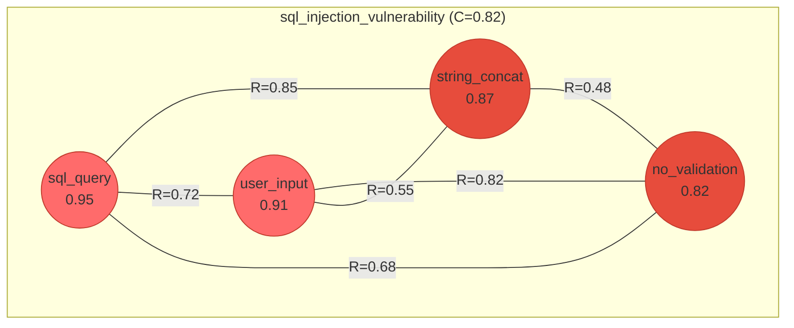

# Basic NFOS Session Walkthrough

A step-by-step example of using NFOS for a code security analysis task.

---

## Scenario

We're analyzing a code snippet for potential security vulnerabilities. The code handles user input and constructs a database query.

---

## Session Transcript

### 1. Initialize Session

```
> nf session new "Code Security Analysis"
╔═══════════════════════════════════════════════════════════════════════════════╗
║                    NEURAL FIELD OPERATING SYSTEM v1.0                          ║
╚═══════════════════════════════════════════════════════════════════════════════╝

[SESSION] Created: Code Security Analysis
  Session ID: sess_001
  Field: main (default)
  Parameters: λ=0.05, α=0.30, τ=0.40, σ=0.50
  Mode: step (interactive)

Type 'nf help' for command reference
```

### 2. Inject Initial Patterns

We've identified several concerns from the code. Let's inject them as patterns.

```
> nf inject "sql_query_construction" 0.9
[INJECT] sql_query_construction (s: 0.90)
  Field: main
  ID: p_001
  Position: (0.42, 0.78, 0.33)
  Patterns active: 1

> nf inject "user_input_handling" 0.85
[INJECT] user_input_handling (s: 0.85)
  Field: main
  ID: p_002
  Position: (0.38, 0.72, 0.41)
  Patterns active: 2

  [IMMEDIATE RESONANCE]
    ↔ @sql_query_construction: R = 0.72

> nf inject "string_concatenation" 0.8
[INJECT] string_concatenation (s: 0.80)
  Field: main
  ID: p_003
  Position: (0.45, 0.65, 0.28)
  Patterns active: 3

  [IMMEDIATE RESONANCE]
    ↔ @sql_query_construction: R = 0.85
    ↔ @user_input_handling: R = 0.55

> nf inject "no_input_validation" 0.75
[INJECT] no_input_validation (s: 0.75)
  Field: main
  ID: p_004
  Position: (0.35, 0.68, 0.52)
  Patterns active: 4

  [IMMEDIATE RESONANCE]
    ↔ @user_input_handling: R = 0.82
    ↔ @sql_query_construction: R = 0.68
```

### 3. Check Initial Field State

```
> nf state --compact
[FIELD] main
  Cycle: 0, Coherence: 0.65 [MEDIUM]
  Patterns: 4 active
  Attractors: 0
  Energy: 2.73

> nf resonate --all --above 0.5
[RESONANCE] All pairs (R > 0.5)
  @sql_query_construction ↔ @string_concatenation: 0.85 [STRONG]
  @user_input_handling ↔ @no_input_validation: 0.82 [STRONG]
  @sql_query_construction ↔ @user_input_handling: 0.72 [STRONG]
  @sql_query_construction ↔ @no_input_validation: 0.68 [MODERATE]
  @user_input_handling ↔ @string_concatenation: 0.55 [MODERATE]

  Mean resonance: 0.72
  Clusters forming: 1 (all connected)
```

### 4. Run Dynamics

```
> nf cycle 3 --trace
[CYCLE 1]

  DECAY: Apply λ=0.05
    @sql_query_construction: 0.90 → 0.86
    @user_input_handling: 0.85 → 0.81
    @string_concatenation: 0.80 → 0.76
    @no_input_validation: 0.75 → 0.71

  RESONANCE:
    @sql_query_construction ↔ @string_concatenation: R = 0.85 [STRONG]
      Semantic: both about building query strings
      Logical: concatenation is HOW queries are built unsafely
      Contextual: SQL vulnerability pattern

    @user_input_handling ↔ @no_input_validation: R = 0.82 [STRONG]
      Semantic: input processing concerns
      Logical: lack of validation IS a handling issue
      Contextual: security boundary concern

    @sql_query_construction ↔ @user_input_handling: R = 0.72 [STRONG]
      Semantic: both about data flow
      Logical: user input flows into SQL query
      Contextual: attack vector pattern

    @sql_query_construction ↔ @no_input_validation: R = 0.68 [MODERATE]
      Semantic: validation affects query safety
      Logical: missing validation enables injection
      Contextual: vulnerability chain

  AMPLIFY:
    @sql_query_construction: 0.86 → 0.94 (resonance boost: +0.08)
    @user_input_handling: 0.81 → 0.89 (resonance boost: +0.08)
    @string_concatenation: 0.76 → 0.84 (resonance boost: +0.08)
    @no_input_validation: 0.71 → 0.79 (resonance boost: +0.08)

  COHERENCE: 0.72 [HIGH]

  [ATTRACTOR CHECK]
    ✓ Coherence > 0.6 (0.72)
    ✓ Energy concentrated: 100%
    ✗ Stability: testing...

  Cluster forming but not yet stable.

---

[CYCLE 2]

  DECAY: Apply λ=0.05
    @sql_query_construction: 0.94 → 0.89
    @user_input_handling: 0.89 → 0.85
    @string_concatenation: 0.84 → 0.80
    @no_input_validation: 0.79 → 0.75

  RESONANCE: (cached, no significant changes)

  AMPLIFY:
    @sql_query_construction: 0.89 → 0.95 (resonance boost)
    @user_input_handling: 0.85 → 0.91 (resonance boost)
    @string_concatenation: 0.80 → 0.87 (resonance boost)
    @no_input_validation: 0.75 → 0.82 (resonance boost)

  COHERENCE: 0.78 [HIGH]

  [ATTRACTOR CHECK]
    ✓ Coherence > 0.6 (0.78)
    ✓ Energy concentrated: 100%
    ✓ Stability verified

  [ATTRACTOR-EMERGED] "sql_injection_vulnerability"
    Core: {@sql_query_construction, @user_input_handling,
           @string_concatenation, @no_input_validation}
    Coherence: 0.82
    Emerged: cycle 2

---

[CYCLE 3]

  DECAY: Apply λ=0.05
    (all patterns decay slightly)

  RESONANCE: (stable)

  AMPLIFY:
    (patterns maintain through resonance)

  COHERENCE: 0.82 [HIGH]

  [ATTRACTOR] "sql_injection_vulnerability" stable
    Energy: 100%
    All core patterns mutually reinforcing

---

[SUMMARY] 3 cycles completed
  Final coherence: 0.82 [HIGH]
  Attractor emerged: sql_injection_vulnerability (cycle 2)
  Pattern activations stable
```

### 5. Examine the Attractor

```
> nf attractor info sql_injection_vulnerability --full
[ATTRACTOR] sql_injection_vulnerability
  Coherence: 0.82 [HIGH]
  Stability: 0.91 [VERY HIGH]
  Emerged: cycle 2
  Age: 1 cycle

  Core Patterns:
    @sql_query_construction: 0.95 (dominant)
    @user_input_handling: 0.91
    @string_concatenation: 0.87
    @no_input_validation: 0.82

  Resonance Structure:
    @sql_query_construction ↔ @string_concatenation: 0.85 [STRONG]
    @user_input_handling ↔ @no_input_validation: 0.82 [STRONG]
    @sql_query_construction ↔ @user_input_handling: 0.72 [STRONG]
    @sql_query_construction ↔ @no_input_validation: 0.68 [MODERATE]
    @user_input_handling ↔ @string_concatenation: 0.55 [MODERATE]
    @string_concatenation ↔ @no_input_validation: 0.48 [MODERATE]

    Mean core resonance: 0.68

  Basin:
    Patterns that would flow here:
      @parameterized_queries (potential mitigation)
      @input_sanitization (potential mitigation)
      @prepared_statements (potential mitigation)

  Energy: 3.14 (100% of field)

  Semantic Summary:
    This attractor represents a SQL injection vulnerability pattern.
    The code constructs SQL queries using string concatenation with
    user input that lacks validation. All four concerns mutually
    reinforce, indicating a coherent and high-confidence finding.
```

### 6. Visualize the Field

```
> nf plot network
[NETWORK] Resonance graph for field: main



```
> nf plot field --style ascii
[FIELD: main] Coherence: 0.82 [HIGH]

Activation Distribution:
   1.0 ┤  ████
       │  ████████
   0.8 ┤  ████████████████
       │  ████████████████████
   0.6 ┤  ████████████████████
       │  ████████████████████
   0.4 ┤
       │
   0.2 ┤
       │
   0.0 ┼──────────────────────────
        sql    user   string  no_val
        query  input  concat  idation

Energy: ████████████████████ 100%
Attractor: sql_injection_vulnerability
```

### 7. Collapse to Output

```
> nf collapse --strategy attractor
[COLLAPSE] Strategy: attractor
  Dominant attractor: sql_injection_vulnerability (0.82)

╔══════════════════════════════════════════════════════════════════════╗
║                              OUTPUT                                   ║
╚══════════════════════════════════════════════════════════════════════╝

FINDING: SQL Injection Vulnerability

The field analysis has converged on a SQL injection vulnerability pattern
with high confidence (coherence: 0.82).

EVIDENCE:
  • SQL queries are constructed dynamically (A=0.95)
  • User input is incorporated into queries (A=0.91)
  • String concatenation is used for query building (A=0.87)
  • Input validation is absent (A=0.82)

ATTACK VECTOR:
  User input → (no validation) → string concatenation → SQL query
  An attacker can inject malicious SQL through the user input field.

RECOMMENDATION:
  1. Use parameterized queries or prepared statements
  2. Implement input validation and sanitization
  3. Apply principle of least privilege for database access
  4. Consider using an ORM with built-in protections

CONFIDENCE: HIGH (0.82)
  All patterns mutually reinforce, indicating a coherent finding.
  The attractor is stable and would persist under perturbation.

╚══════════════════════════════════════════════════════════════════════╝
```

### 8. Save the Analysis

```
> nf commit "SQL injection vulnerability identified"
[COMMIT] a1b2c3d: "SQL injection vulnerability identified"
  Patterns: 4
  Attractors: 1
  Coherence: 0.82
  Snapshot saved

> nf history
[HISTORY] main

  * a1b2c3d (HEAD) - SQL injection vulnerability identified
      Patterns: 4, Coherence: 0.82
      Attractor: sql_injection_vulnerability

  * (initial) - Session start
```

### 9. Explore Mitigation (Optional Branch)

```
> nf branch create mitigation_analysis
[BRANCH] Created: mitigation_analysis
  Based on: a1b2c3d

> nf inject "parameterized_queries" 0.9 --tags mitigation
[INJECT] parameterized_queries (s: 0.90)
  Field: main
  Patterns active: 5

  [IMMEDIATE RESONANCE]
    ↔ @sql_query_construction: R = 0.78 (complementary)

> nf inject "input_validation" 0.85 --tags mitigation
[INJECT] input_validation (s: 0.85)
  Field: main
  Patterns active: 6

  [IMMEDIATE RESONANCE]
    ↔ @no_input_validation: R = -0.65 (opposing!)
    ↔ @user_input_handling: R = 0.72

> nf cycle 3 --compact
[CYCLES 1-3]
  1: C=0.55, 6 patterns (competition)
  2: C=0.48, 5 patterns (no_input_validation decaying)
  3: C=0.72, 5 patterns [NEW ATTRACTOR: secure_pattern]

[ATTRACTOR-EMERGED] "secure_pattern"
  Core: {@parameterized_queries, @input_validation, @user_input_handling}
  Coherence: 0.75
  Note: Original vulnerability patterns attenuated

> nf attractor list
[ATTRACTORS] 2 emerged

  1. secure_pattern (coherence: 0.75) [DOMINANT]
     Core: {@parameterized_queries, @input_validation, @user_input_handling}
     Emerged: cycle 3 (this branch)

  2. sql_injection_vulnerability (coherence: 0.42) [WEAKENED]
     Core: {@sql_query_construction, @string_concatenation}
     Status: Losing energy to mitigation patterns

> nf commit "Mitigation patterns added - secure attractor emerged"
[COMMIT] e5f6g7h: "Mitigation patterns added - secure attractor emerged"
```

### 10. Compare Branches

```
> nf checkout main
[CHECKOUT] main (a1b2c3d)
  Restored: SQL injection vulnerability identified

> nf diff mitigation_analysis
[DIFF] main..mitigation_analysis

  Added patterns:
    + @parameterized_queries (0.88)
    + @input_validation (0.85)

  Changed patterns:
    @no_input_validation: 0.82 → 0.25 [ATTENUATED]
    @string_concatenation: 0.87 → 0.45 [ATTENUATED]

  Attractors:
    main: sql_injection_vulnerability (0.82)
    mitigation_analysis: secure_pattern (0.75)

  Coherence: 0.82 → 0.72

  Summary:
    Mitigation patterns successfully competed with vulnerability
    patterns, establishing a new attractor representing secure code.
```

### 11. Session Summary

```
> nf session info
[SESSION] Code Security Analysis
  ID: sess_001
  Duration: ~15 minutes
  Total cycles: 6

  Branches:
    * main (a1b2c3d) - SQL injection vulnerability identified
      mitigation_analysis (e5f6g7h) - Mitigation patterns added

  Findings:
    1. SQL injection vulnerability identified (main)
       Confidence: HIGH (0.82)
    2. Mitigation strategy validated (mitigation_analysis)
       Secure attractor emerged (0.75)

  Patterns used: 6
  Attractors emerged: 2

  Export available: nf session export json
```

---

## Key Takeaways

1. **Pattern Injection**: Start by injecting observations as patterns with appropriate strengths
2. **Resonance Discovery**: The system automatically finds relationships between patterns
3. **Attractor Emergence**: Related patterns cluster into stable attractors representing coherent findings
4. **Visualization**: Network graphs and field plots help understand the analysis
5. **Collapse**: Convert the field state into actionable output
6. **Versioning**: Save states and explore alternatives with branching

---

## Next Steps

- Try `nf help <command>` for detailed command documentation
- Explore visualization options: `nf plot topology --3d`
- Use `nf mode checkpoint` for semi-autonomous analysis
- See `02-versioning.md` for advanced versioning workflows
- See `03-visualization.md` for visualization deep-dive
