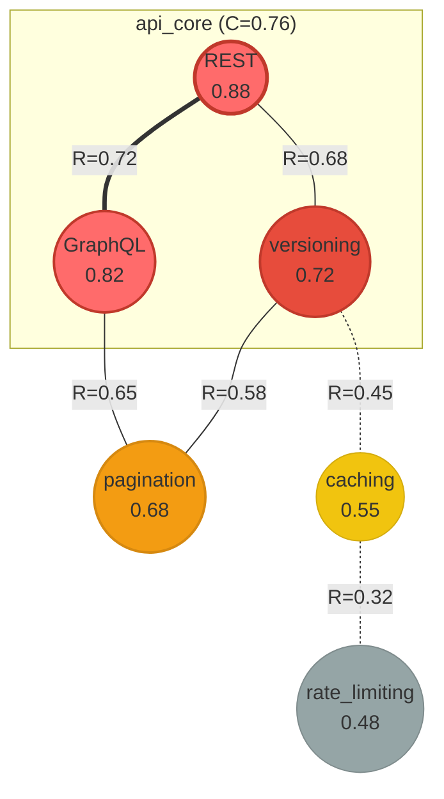
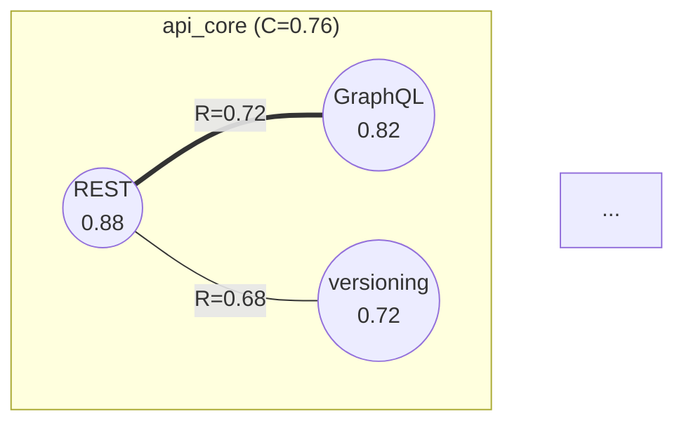

# Example 3: Visualization Walkthrough

A complete walkthrough demonstrating NFOS visualization capabilities across multiple formats and plot types.

---

## Scenario: Visualizing API Design Evolution

We're designing an API and want to visualize how different design patterns resonate and compete. This example shows all visualization types.

---

## Session Start

```
> nf init api_design
[NFOS] Initialized field: api_design
  Parameters: λ=0.05, α=0.3, τ=0.4, σ=0.5
```

---

## 1. Building the Field

### Inject Patterns

```
> nf inject "REST" 0.85 --tags architecture
[INJECT] Pattern 'REST' added with activation 0.85

> nf inject "GraphQL" 0.80 --tags architecture
[INJECT] Pattern 'GraphQL' added with activation 0.80

> nf inject "versioning" 0.75 --tags practice
[INJECT] Pattern 'versioning' added with activation 0.75

> nf inject "pagination" 0.70 --tags practice
[INJECT] Pattern 'pagination' added with activation 0.70

> nf inject "caching" 0.65 --tags performance
[INJECT] Pattern 'caching' added with activation 0.65

> nf inject "rate_limiting" 0.60 --tags security
[INJECT] Pattern 'rate_limiting' added with activation 0.60
```

### Run Dynamics

```
> nf cycle 3 --trace
[CYCLE] Running 3 dynamics cycles...

  Cycle 1:
    Decay: Applied λ=0.05
    Resonance: 15 pairs computed
    Amplification: 4 patterns boosted
    Coherence: 0.52

  Cycle 2:
    Decay: Applied λ=0.05
    Resonance: 15 pairs computed
    Amplification: 3 patterns boosted
    Coherence: 0.68

  Cycle 3:
    Decay: Applied λ=0.05
    Resonance: 15 pairs computed
    Amplification: 2 patterns boosted
    Coherence: 0.74

[COMPLETE] 3 cycles executed
  Final coherence: 0.74
  Attractors emerged: 1
```

---

## 2. Field Visualization

### 2.1 Bar Chart (Default)

```
> nf plot field
[FIELD] api_design (Coherence: 0.74)

REST            │████████████████████████████████████ 0.88
GraphQL         │█████████████████████████████████  0.82
versioning      │████████████████████████████     0.72
pagination      │██████████████████████████       0.68
caching         │████████████████████             0.55
rate_limiting   │██████████████████               0.48
                └────────────────────────────────────
                0.0              0.5              1.0
```

### 2.2 Sorted with Threshold

```
> nf plot field --sort --threshold 0.6
[FIELD] api_design (4 patterns above 0.6)

REST            │████████████████████████████████████ 0.88
GraphQL         │█████████████████████████████████  0.82
versioning      │████████████████████████████     0.72
pagination      │██████████████████████████       0.68
                └────────────────────────────────────
```

### 2.3 Heatmap Style

```
> nf plot field --style heatmap
[FIELD] api_design - Activation Heatmap

          0.0       0.5       1.0
           ├─────────┼─────────┤
REST       ▓▓▓▓▓▓▓▓▓▓▓▓▓▓▓▓▓█  0.88
GraphQL    ▓▓▓▓▓▓▓▓▓▓▓▓▓▓▓▓▓   0.82
versioning ▓▓▓▓▓▓▓▓▓▓▓▓▓▓      0.72
pagination ▓▓▓▓▓▓▓▓▓▓▓▓▓       0.68
caching    ▓▓▓▓▓▓▓▓▓▓          0.55
rate_limit ▓▓▓▓▓▓▓▓▓           0.48
```

---

## 3. Network Visualization

### 3.1 ASCII Network (Terminal)

```
> nf plot network
[NETWORK] Field: api_design (6 patterns, 8 edges)

    ┌──────────┐               ┌──────────┐
    │   REST   │═══════════════│ GraphQL  │
    │   0.88   │    R=0.72     │   0.82   │
    └────┬─────┘               └────┬─────┘
         │                          │
         │ R=0.68                   │ R=0.65
         │                          │
    ┌────┴─────┐               ┌────┴─────┐
    │versioning│───────────────│pagination│
    │   0.72   │    R=0.58     │   0.68   │
    └────┬─────┘               └──────────┘
         │
         │ R=0.45
         │
    ┌────┴─────┐               ┌──────────┐
    │ caching  │╌╌╌╌╌╌╌╌╌╌╌╌╌╌╌│rate_limit│
    │   0.55   │    R=0.32     │   0.48   │
    └──────────┘               └──────────┘

Legend: ═══ Strong (R>0.6)  ─── Moderate  ╌╌╌ Weak
```

### 3.2 Mermaid Diagram

```
> nf plot network --format mermaid
```

Output:


### 3.3 With Weights Shown

```
> nf plot network --weights --threshold 0.5
[NETWORK] Field: api_design (threshold: 0.5)

    ┌──────────┐    0.72     ┌──────────┐
    │   REST   │═════════════│ GraphQL  │
    │   0.88   │             │   0.82   │
    └────┬─────┘             └────┬─────┘
      0.68│                       │0.65
    ┌────┴─────┐    0.58     ┌────┴─────┐
    │versioning│─────────────│pagination│
    │   0.72   │             │   0.68   │
    └──────────┘             └──────────┘

[INFO] 2 edges below threshold hidden
```

---

## 4. Resonance Matrix

```
> nf plot matrix
[RESONANCE MATRIX] Field: api_design

              REST   Graph  vers   pagi   cache  rate
REST          1.00   0.72   0.68   0.45   0.38   0.22
GraphQL       0.72   1.00   0.55   0.65   0.42   0.28
versioning    0.68   0.55   1.00   0.58   0.45   0.35
pagination    0.45   0.65   0.58   1.00   0.40   0.30
caching       0.38   0.42   0.45   0.40   1.00   0.32
rate_limiting 0.22   0.28   0.35   0.30   0.32   1.00

Strong: >0.6  ██  Moderate: 0.4-0.6  ▓▓  Weak: <0.4  ░░
```

### Heatmap Format

```
> nf plot matrix --format heatmap
[RESONANCE MATRIX] Heatmap

              REST   Graph  vers   pagi   cache  rate
REST          ██████ █████▓ █████▓ ▓▓▓▓▓░ ▓▓▓▓░░ ░░░░░░
GraphQL       █████▓ ██████ ▓▓▓▓▓▓ █████▓ ▓▓▓▓▓░ ░░░░░░
versioning    █████▓ ▓▓▓▓▓▓ ██████ ▓▓▓▓▓▓ ▓▓▓▓▓░ ▓▓▓░░░
pagination    ▓▓▓▓▓░ █████▓ ▓▓▓▓▓▓ ██████ ▓▓▓▓░░ ▓▓░░░░
caching       ▓▓▓▓░░ ▓▓▓▓▓░ ▓▓▓▓▓░ ▓▓▓▓░░ ██████ ▓▓▓░░░
rate_limiting ░░░░░░ ░░░░░░ ▓▓▓░░░ ▓▓░░░░ ▓▓▓░░░ ██████
```

---

## 5. Topology Visualization

### 5.1 Contour Plot (ASCII)

```
> nf plot topology
[TOPOLOGY] Field: api_design

    ┌────────────────────────────────────────────┐
 1.0│  ·    ·    ·    ·    ·    ·    ·    ·     │
    │        ╭─────────────────────╮             │
 0.8│      ╭─┤      Basin A        ├─╮           │
    │     ╭┤ │                     │ ├╮          │
 0.6│     ││ │    ●                │ ││          │
    │     ╰┤ │  api_core (0.76)    │ ├╯          │
 0.4│      ╰─┤                     ├─╯           │
    │        ╰─────────────────────╯             │
 0.2│  ·    ·    ·    ·    ·    ·    ·    ·     │
 0.0└────────────────────────────────────────────┘
    0.0                                         1.0

● Attractor: api_core (Coherence: 0.76)
  Core: REST, GraphQL, versioning
  Basin coverage: 72%
```

### 5.2 Energy Heatmap

```
> nf plot topology --style heatmap
[TOPOLOGY] Energy Distribution

    0.0       0.5       1.0
     ├─────────┼─────────┤
 1.0 │░░░░░░░░░░░░░░░░░░░│
     │░░░░░░░░░░░░░░░░░░░│
 0.8 │░░░▒▒▒▒▒▒▒▒▒▒▒░░░░░│
     │░░▒▓▓▓▓▓▓▓▓▓▓▓▒░░░░│
 0.6 │░░▒▓████●████▓▒░░░░│
     │░░▒▓▓▓▓▓▓▓▓▓▓▓▒░░░░│
 0.4 │░░░▒▒▒▒▒▒▒▒▒▒▒░░░░░│
     │░░░░░░░░░░░░░░░░░░░│
 0.2 │░░░░░░░░░░░░░░░░░░░│
 0.0 └───────────────────┘

● = Attractor minimum (api_core)
█ = Low energy   ░ = High energy
```

---

## 6. Basin Visualization

```
> nf plot basins
[BASINS] Field: api_design

    ┌────────────────────────────────────────────┐
 1.0│ · · · · · · · · · · · · · · · · · · · · · │
    │ · · · · · · · · · · · · · · · · · · · · · │
 0.8│ · · · A A A A A A A A A A · · · · · · · · │
    │ · · A A A A A A A A A A A A · · · · · · · │
 0.6│ · · A A A A A●A A A A A A A · · · · · · · │
    │ · · A A A A A A A A A A A A · · · · · · · │
 0.4│ · · · A A A A A A A A A A · · · · · · · · │
    │ · · · · · · · · · · · · · · · · · · · · · │
 0.2│ · · · · · · · · · · · · · · · · · · · · · │
 0.0└────────────────────────────────────────────┘

  A = api_core (72% of state space)
  ● = Attractor center
  · = Unstable / no dominant attractor
```

---

## 7. Flow Visualization

### Pattern Trajectory

```
> nf plot flow --from @caching --steps 5
[FLOW] Trajectory from @caching

  State Space Trajectory:

  Start (@caching)
       ↓
       ↓ decay + resonance
       ↘
         ↘
           ↘ amplification from versioning
             ↘
               → → → ● api_core

  Steps: 5
  Final attractor: api_core
  Convergence: 4 cycles
```

### Multiple Trajectories

```
> nf plot flow --from @rate_limiting --steps 8
[FLOW] Trajectory from @rate_limiting

  Start (@rate_limiting)
       ↓
       ↓
       ↓ slow resonance
       ↓
         ↘
           ↘ weak pull from caching
             ↘
               ↘
                 → → → ● api_core (converged)

  Steps: 8
  Final attractor: api_core
  Convergence: 7 cycles (slower due to weak initial resonance)
```

---

## 8. Animation

### 8.1 Terminal Animation

```
> nf animate dynamics --cycles 5 --fps 2
[ANIMATION] Starting dynamics animation...

╔══════════════════════════════════════════════════════════════╗
║ Cycle: 1/5                           Coherence: 0.52         ║
╠══════════════════════════════════════════════════════════════╣
║                                                              ║
║  REST        │██████████████████████████████████ 0.86        ║
║  GraphQL     │████████████████████████████████  0.81         ║
║  versioning  │██████████████████████████████   0.74          ║
║  pagination  │████████████████████████████     0.70          ║
║  caching     │██████████████████████           0.58          ║
║  rate_limit  │████████████████████             0.52          ║
║                                                              ║
╠══════════════════════════════════════════════════════════════╣
║ Attractor: (forming)                                         ║
╠══════════════════════════════════════════════════════════════╣
║ [Space] Pause  [←/→] Step  [Q] Quit                         ║
╚══════════════════════════════════════════════════════════════╝

[Frame 1/5]...
[Frame 2/5]...
[Frame 3/5]...
[Frame 4/5]...
[Frame 5/5]...

[COMPLETE] Animation finished
  Final coherence: 0.74
  Attractor emerged at cycle 3
```

### 8.2 Network Animation

```
> nf animate network --cycles 5
[ANIMATION] Network evolution

Frame 1 (Cycle 0):
    ○──○──○
    │     │
    ○──○──○
  Coherence: 0.45

Frame 2 (Cycle 1):
    ●══○──○
    ║     │
    ○──○──○
  Coherence: 0.52

Frame 3 (Cycle 2):
    ●══●──○
    ║  ║  │
    ○──○──○
  Coherence: 0.62

Frame 4 (Cycle 3):
    ●══●══○
    ║  ║  │
    ●──○──○
  Coherence: 0.70

Frame 5 (Cycle 4):
    ●══●══○
    ║  ║  │
    ●══○──○
  Coherence: 0.74

[COMPLETE] Attractor api_core emerged
```

---

## 9. Export Examples

### 9.1 Export as SVG

```
> nf plot network --format svg --output api_network.svg
[EXPORT] Saved network visualization to api_network.svg
  File size: 12.4 KB
  Dimensions: 600x400
```

### 9.2 Export as Mermaid in Markdown

```
> nf export mermaid api_network.md --wrap markdown
[EXPORT] Saved Mermaid diagram to api_network.md
  Format: Markdown-wrapped
```

Contents of `api_network.md`:
````markdown
# API Design Network


````

### 9.3 Export Interactive Plotly

```
> nf plot topology --3d --format plotly --output api_energy.html
[EXPORT] Saved interactive 3D plot to api_energy.html
  File size: 1.2 MB (includes Plotly.js)
  Open in browser to interact
```

### 9.4 Export Animation as GIF

```
> nf animate dynamics --cycles 10 --output api_evolution.gif
[ANIMATION] Recording 10 cycles...
  Generating frames: 100
  Encoding GIF...

[EXPORT] Saved animation to api_evolution.gif
  Frames: 100
  Duration: 10s
  File size: 2.4 MB
```

### 9.5 Export Data as JSON

```
> nf export json api_state.json
[EXPORT] Saved field data to api_state.json

Contents:
{
  "field": {
    "name": "api_design",
    "parameters": {"lambda": 0.05, "alpha": 0.3, "tau": 0.4, "sigma": 0.5}
  },
  "patterns": [
    {"id": "p_001", "name": "REST", "activation": 0.88},
    {"id": "p_002", "name": "GraphQL", "activation": 0.82},
    ...
  ],
  "resonance_matrix": {
    "p_001:p_002": 0.72,
    ...
  },
  "attractors": [
    {"name": "api_core", "coherence": 0.76, "core": ["p_001", "p_002", "p_003"]}
  ]
}
```

---

## 10. 3D Visualization (Plotly)

### 10.1 3D Network in Semantic Space

```
> nf plot network --3d --format plotly
[PLOTLY] Generating 3D semantic space...

  Patterns positioned by semantic similarity:
  - X: Architecture dimension
  - Y: Practice dimension
  - Z: Performance/Security dimension

[INTERACTIVE] Open in browser:
  - Rotate: Click + drag
  - Zoom: Scroll
  - Pan: Right-click + drag
  - Hover: Pattern details
```

### 10.2 3D Energy Surface

```
> nf plot topology --3d --format plotly --resolution 100
[PLOTLY] Generating 3D energy landscape...

  Surface represents energy function E(x,y)
  Lower valleys = attractor basins
  Peaks = unstable regions

  Red markers = attractor positions

[INTERACTIVE] Controls:
  - Rotate to see basin depths
  - Hover for energy values
  - Click attractors for details
```

---

## 11. Comparative Visualization

### Save State and Compare

```
> nf commit "Initial API design"
[COMMIT] Saved: abc123
  Message: Initial API design
  Patterns: 6
  Attractors: 1

> nf inject "WebSocket" 0.70 --tags realtime
> nf inject "streaming" 0.65 --tags realtime
> nf cycle 3
> nf commit "Added realtime patterns"
[COMMIT] Saved: def456

> nf diff abc123 def456 --visual
[DIFF] Comparing abc123 → def456

Pattern Changes:
  + WebSocket   [░░░░░░░░░░░░░░] 0.68  (new)
  + streaming   [░░░░░░░░░░░░░] 0.62   (new)
  ~ REST        [█████████████] 0.88 → 0.85  (-0.03)
  ~ GraphQL     [████████████] 0.82 → 0.80   (-0.02)

Network Change:
  Before: 8 edges
  After: 14 edges (+6)

  New connections:
    WebSocket ─── REST (R=0.52)
    WebSocket ─── streaming (R=0.78)
    streaming ─── GraphQL (R=0.48)
    ...

Attractor Change:
  api_core: 0.76 → 0.72 (weakened by competing patterns)
```

---

## 12. Multi-Format Workflow

### Documentation Generation

```bash
# Generate all visualizations for documentation
> nf plot network --format mermaid > docs/network.md
> nf plot network --format svg --output docs/network.svg
> nf plot topology --format svg --output docs/topology.svg
> nf plot matrix --format ascii > docs/matrix.txt
> nf export json docs/state.json

# Generate interactive exploration page
> nf plot topology --3d --format plotly --output docs/explore.html
```

### Presentation Package

```
> nf export-all presentation/ --formats svg,mermaid,json
[EXPORT] Creating presentation package...

  presentation/
  ├── field.svg
  ├── network.svg
  ├── network.mermaid.md
  ├── topology.svg
  ├── matrix.svg
  ├── basins.svg
  └── data.json

[COMPLETE] 7 files exported
```

---

## Session Summary

This walkthrough demonstrated:

1. **Field Visualization**: Bar charts, heatmaps for activation display
2. **Network Graphs**: ASCII, Mermaid, SVG resonance networks
3. **Resonance Matrix**: Tabular and heatmap correlation views
4. **Topology**: Contour plots and energy landscapes
5. **Basin Maps**: Attractor basin coverage visualization
6. **Flow Diagrams**: Pattern trajectory visualization
7. **Animation**: Terminal and file-based dynamics animation
8. **Export**: SVG, Mermaid, Plotly, GIF, JSON formats
9. **3D Interactive**: Plotly-based semantic space and energy surfaces
10. **Comparative**: Visual diff between states

---

## Quick Reference

```
VISUALIZATION COMMANDS
──────────────────────────────────────────────────────
nf plot field [--style bar|heatmap|pie] [--sort]
nf plot network [--format ascii|mermaid|svg] [--3d]
nf plot topology [--style contour|heatmap|surface]
nf plot matrix [--format text|heatmap]
nf plot basins [--attractor <name>]
nf plot flow [--from @pattern] [--steps n]

nf animate dynamics [--cycles n] [--fps f]
nf animate network [--cycles n]
nf animate attractor [--name <name>]

nf export svg|mermaid|plotly|json|gif <filename>
nf export-all <directory> [--formats ...]
```

---

## Related Documents

- `../commands/visualization.md` - Command reference
- `../visualization/topology.md` - Topology specs
- `../visualization/networks.md` - Network graph specs
- `../visualization/generators/` - Format generators
