# Mermaid Diagram Generator

Specifications for generating Mermaid.js diagrams for network and flowchart visualizations.

---

## 1. Overview

Mermaid generates text-based diagram definitions that render in Markdown, GitHub, and documentation platforms.

---

## 2. Supported Diagram Types

| Type | Use Case | Mermaid Type |
|------|----------|--------------|
| Network | Resonance graphs | `graph` |
| Flow | Dynamics flow | `flowchart` |
| State | Field states | `stateDiagram-v2` |
| Timeline | History | `timeline` |

---

## 3. Network Graphs

### 3.1 Basic Structure

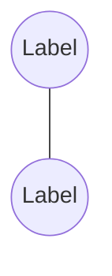

### 3.2 Node Shapes

| Shape | Syntax | Use For |
|-------|--------|---------|
| Circle | `((text))` | Patterns |
| Round rect | `(text)` | Concepts |
| Stadium | `([text])` | Events |
| Diamond | `{text}` | Decisions |
| Hexagon | `{{text}}` | Attractors |

### 3.3 Edge Types

| Type | Syntax | Meaning |
|------|--------|---------|
| Solid | `---` | Strong resonance |
| Arrow | `-->` | Flow direction |
| Dotted | `-.-` | Weak resonance |
| Thick | `===` | Very strong |
| With label | `--\|label\|` | Resonance value |

### 3.4 Full Network Example

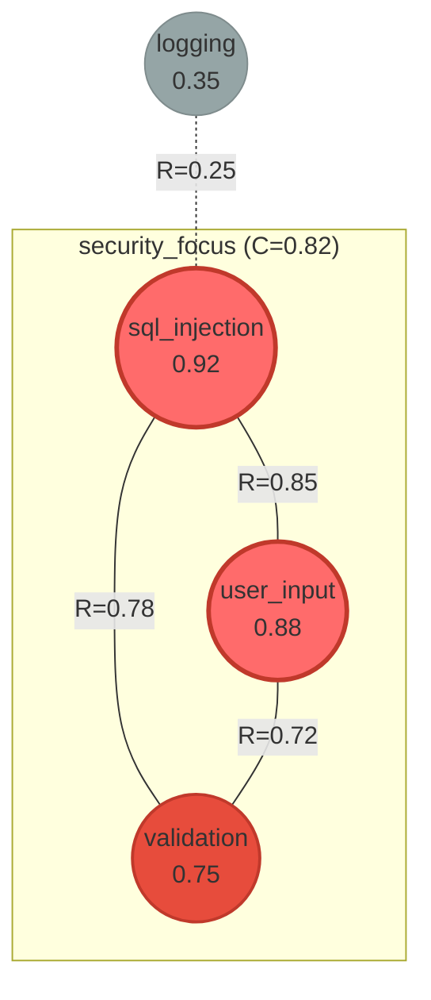

---

## 4. Generation Algorithm

### 4.1 Network Generation

```
GENERATE_MERMAID_NETWORK(field, threshold=0.2):
  lines = ["graph TB"]

  // Group by attractors
  FOR attractor IN field.attractors:
    lines.append(f'    subgraph {sanitize(attractor.name)}["{attractor.name} (C={attractor.coherence:.2f})"]')
    FOR pattern_id IN attractor.core_patterns:
      pattern = field.patterns[pattern_id]
      lines.append(f'        {pattern_id}(({pattern.name}<br/>{pattern.activation:.2f}))')
    lines.append('    end')

  // Non-attractor patterns
  FOR pattern IN field.patterns:
    IF NOT in_any_attractor(pattern):
      lines.append(f'    {pattern.id}(({pattern.name}<br/>{pattern.activation:.2f}))')

  // Edges
  FOR (p1, p2), resonance IN field.resonance_cache:
    IF resonance >= threshold:
      edge = format_edge(p1, p2, resonance)
      lines.append(f'    {edge}')

  // Styles
  lines.extend(generate_styles(field))

  RETURN "\n".join(lines)
```

### 4.2 Edge Formatting

```
FORMAT_EDGE(p1, p2, resonance):
  IF resonance > 0.7:
    connector = "===|\"R={:.2f}\"|".format(resonance)
  ELSE IF resonance > 0.4:
    connector = "---|\"R={:.2f}\"|".format(resonance)
  ELSE IF resonance > 0.2:
    connector = "-.-|\"R={:.2f}\"|".format(resonance)
  ELSE IF resonance < 0:  // Tension
    connector = "-.->|\"T={:.2f}\"|".format(abs(resonance))

  RETURN f"{p1} {connector} {p2}"
```

### 4.3 Style Generation

```
GENERATE_STYLES(field):
  styles = []

  FOR pattern IN field.patterns:
    color = activation_to_color(pattern.activation)
    border = get_border_style(pattern, field)
    width = activation_to_width(pattern.activation)

    styles.append(
      f"    style {pattern.id} fill:{color},stroke:{border},stroke-width:{width}px"
    )

  RETURN styles
```

### 4.4 Color Mapping

```
ACTIVATION_TO_COLOR(activation):
  IF activation > 0.8:
    RETURN "#ff6b6b"  // High - red
  ELSE IF activation > 0.6:
    RETURN "#e74c3c"  // Medium-high
  ELSE IF activation > 0.4:
    RETURN "#f39c12"  // Medium - orange
  ELSE IF activation > 0.2:
    RETURN "#f1c40f"  // Low-medium - yellow
  ELSE:
    RETURN "#95a5a6"  // Low - gray
```

---

## 5. Flowchart Diagrams

### 5.1 Dynamics Flow

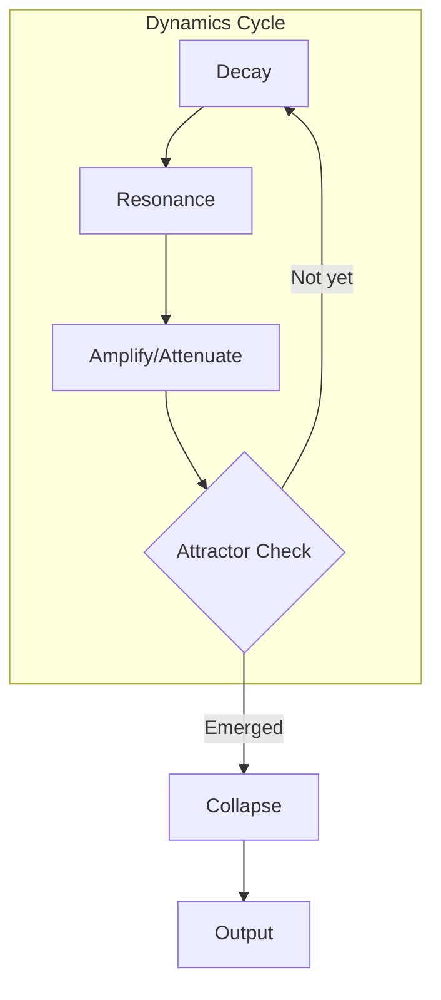

### 5.2 State Transitions

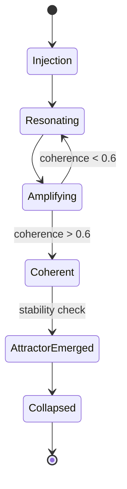

---

## 6. Direction Options

| Direction | Code | Layout |
|-----------|------|--------|
| Top-Bottom | `TB` | Hierarchical |
| Bottom-Top | `BT` | Inverted |
| Left-Right | `LR` | Horizontal |
| Right-Left | `RL` | Reversed |

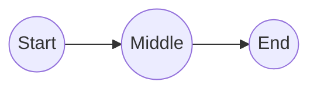

---

## 7. Subgraph Styling

### 7.1 Attractor Grouping

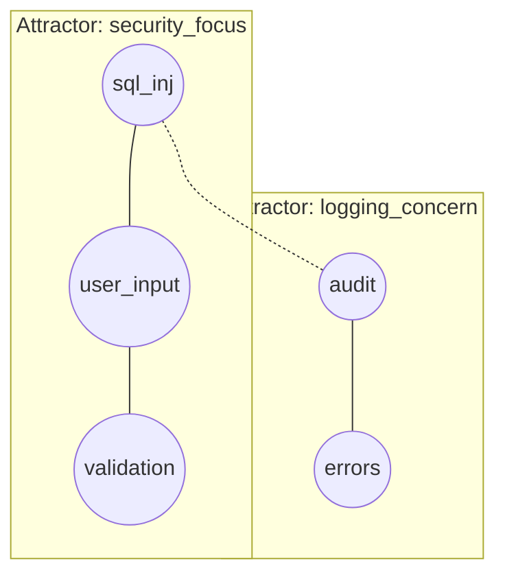

### 7.2 Nested Subgraphs

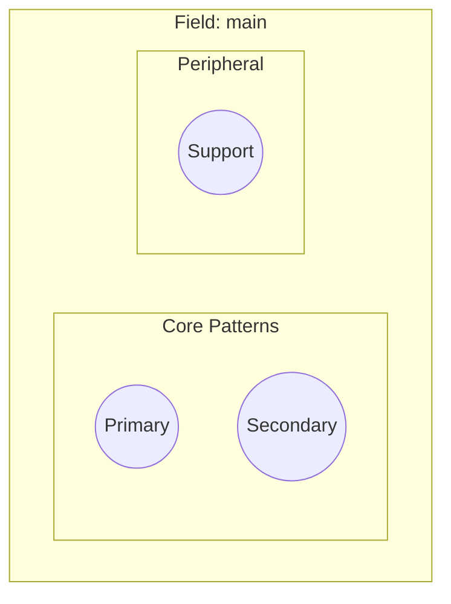

---

## 8. Advanced Features

### 8.1 Click Actions

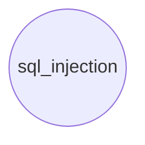

### 8.2 Tooltips


### 8.3 Links with URLs

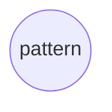

---

## 9. Multi-Field Networks

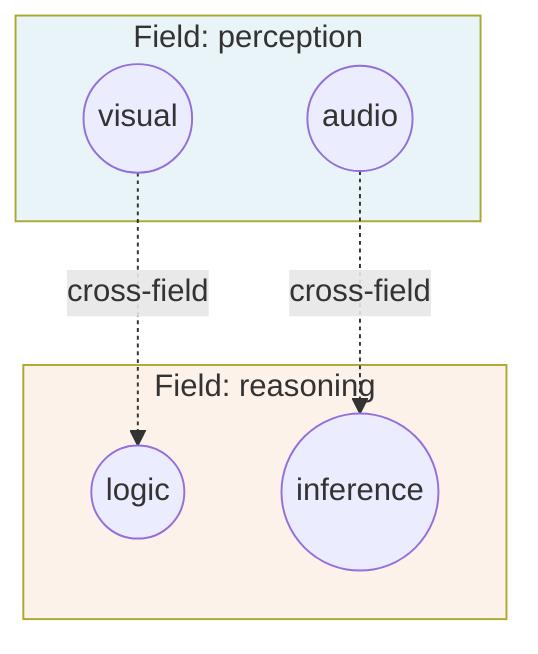

---

## 10. Output Formats

### 10.1 Raw Mermaid

```bash
> nf plot network --format mermaid
```

Output:
```
graph TB
    subgraph security_focus["security_focus (C=0.82)"]
        p_001((sql_injection<br/>0.92))
        p_002((user_input<br/>0.88))
    end
    p_001 ---|"R=0.85"| p_002
    style p_001 fill:#ff6b6b
```

### 10.2 Markdown Wrapped

```bash
> nf plot network --format mermaid --wrap markdown
```

Output:
````markdown
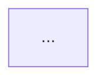
````

### 10.3 HTML Embedded

```bash
> nf plot network --format mermaid --wrap html --output network.html
```

Output:
```html
<!DOCTYPE html>
<html>
<head>
  <script src="https://cdn.jsdelivr.net/npm/mermaid/dist/mermaid.min.js"></script>
</head>
<body>
  <div class="mermaid">
    graph TB
        ...
  </div>
  <script>mermaid.initialize({startOnLoad:true});</script>
</body>
</html>
```

---

## 11. Limitations

| Limitation | Workaround |
|------------|------------|
| No curved edges | Use intermediate nodes |
| Limited styling | Use classDef for groups |
| No animation | Export to other format |
| Size constraints | Split large graphs |

---

## 12. API

```python
class MermaidGenerator:
    def __init__(self, direction="TB"):
        self.direction = direction
        self.nodes = []
        self.edges = []
        self.subgraphs = []
        self.styles = []

    def add_node(self, id, label, shape="circle"):
        """Add node to diagram"""

    def add_edge(self, source, target, label=None, style="solid"):
        """Add edge between nodes"""

    def add_subgraph(self, name, title, nodes):
        """Group nodes in subgraph"""

    def add_style(self, node_id, fill, stroke, stroke_width):
        """Add node styling"""

    def render(self):
        """Generate Mermaid code"""

    def to_markdown(self):
        """Wrap in markdown code block"""

    def to_html(self):
        """Generate standalone HTML"""
```

---

## 13. Examples

### 13.1 Simple Network

```bash
> nf inject "a" 0.9
> nf inject "b" 0.8
> nf cycle 2
> nf plot network --format mermaid
```

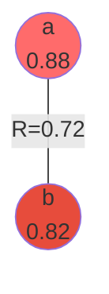

### 13.2 Complex with Attractors

See network examples in `../networks.md`.

---

## Related Documents

- `ascii.md` - ASCII generation
- `svg.md` - SVG generation
- `plotly.md` - Interactive plots
- `../networks.md` - Network visualization
