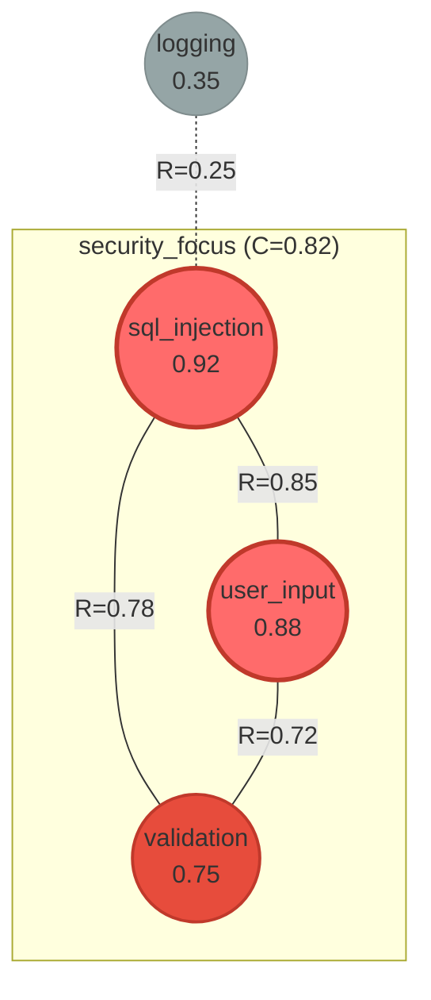

# Resonance Network Visualization

Specifications for visualizing the resonance structure as network graphs showing patterns as nodes and resonances as edges.

---

## 1. Overview

Network visualization represents:
- **Nodes**: Patterns (size = activation)
- **Edges**: Resonances (thickness = strength)
- **Clusters**: Attractors (grouped nodes)
- **Colors**: Semantic categories or activation levels

---

## 2. Network Structure

### 2.1 Node Properties

| Property | Mapped From | Visual |
|----------|-------------|--------|
| Size | Activation (0-1) | Radius 10-50px |
| Color | Category/activation | Color scale |
| Label | Pattern name | Text |
| Border | Attractor membership | Highlight |

### 2.2 Edge Properties

| Property | Mapped From | Visual |
|----------|-------------|--------|
| Thickness | Resonance (0-1) | Width 1-8px |
| Color | Resonance type | Green/gray/red |
| Style | Strength class | Solid/dashed/dotted |
| Label | R value | Optional text |

### 2.3 Resonance Classification

| Class | Range | Style | Color |
|-------|-------|-------|-------|
| STRONG | >0.7 | Solid thick | Green |
| MODERATE | 0.4-0.7 | Solid | Gray |
| WEAK | 0.2-0.4 | Dashed | Light gray |
| TENSION | <0 | Dotted | Red |

---

## 3. Layout Algorithms

### 3.1 Force-Directed (Default)

Nodes repel, edges attract based on resonance.

```
FORCE_DIRECTED_LAYOUT(nodes, edges, iterations=100):
  // Initialize random positions
  FOR node IN nodes:
    node.x = random(0, width)
    node.y = random(0, height)

  FOR i IN range(iterations):
    // Repulsion between all nodes
    FOR n1 IN nodes:
      FOR n2 IN nodes:
        IF n1 != n2:
          force = repulsion_force(n1, n2)
          n1.velocity += force

    // Attraction along edges
    FOR edge IN edges:
      force = attraction_force(edge.source, edge.target, edge.weight)
      edge.source.velocity += force
      edge.target.velocity -= force

    // Apply velocities with damping
    FOR node IN nodes:
      node.x += node.velocity.x * damping
      node.y += node.velocity.y * damping
      node.velocity *= 0.9

  RETURN nodes
```

### 3.2 Semantic Layout

Positions based on semantic coordinates.

```
SEMANTIC_LAYOUT(nodes, field):
  FOR node IN nodes:
    pattern = field.patterns[node.id]
    // Use first two dimensions of semantic position
    node.x = pattern.position[0] * width
    node.y = pattern.position[1] * height

  RETURN nodes
```

### 3.3 Hierarchical Layout

Attractors at top, basin patterns below.

```
HIERARCHICAL_LAYOUT(nodes, attractors):
  levels = {}

  // Level 0: Attractor cores
  FOR attractor IN attractors:
    FOR pattern_id IN attractor.core_patterns:
      levels[pattern_id] = 0

  // Level 1+: Distance from core
  remaining = [n for n in nodes if n.id not in levels]
  level = 1
  WHILE remaining:
    FOR node IN remaining:
      max_resonance_to_higher = max([
        R(node, n) for n in nodes if levels.get(n.id, 999) < level
      ])
      IF max_resonance_to_higher > 0.4:
        levels[node.id] = level
        remaining.remove(node)
    level += 1

  // Position by level
  FOR node IN nodes:
    node.y = levels[node.id] * level_height
    node.x = distribute_horizontally(node, levels)

  RETURN nodes
```

---

## 4. Rendering Formats

### 4.1 ASCII Network

```
[NETWORK] Field: main (threshold: 0.4)

                    ┌─────────────────────────────────────┐
                    │     Attractor: security_focus       │
                    │  ┌─────────────────────────────┐    │
                    │  │                             │    │
    ┌───────┐       │  │   ┌───────┐   ┌───────┐   │    │
    │logging│╌╌╌╌╌╌╌┼──┼───│ sql   │═══│ user  │   │    │
    │ 0.35  │       │  │   │ 0.92  │   │ 0.88  │   │    │
    └───────┘       │  │   └───┬───┘   └───┬───┘   │    │
                    │  │       │           │       │    │
                    │  │       │    ═══════╪═══    │    │
                    │  │       │           │       │    │
                    │  │   ┌───┴───────────┴───┐   │    │
                    │  │   │   validation      │   │    │
                    │  │   │      0.75         │   │    │
                    │  │   └───────────────────┘   │    │
                    │  └─────────────────────────────┘    │
                    └─────────────────────────────────────┘

Legend:
  ═══ Strong (R > 0.7)
  ─── Moderate (R 0.4-0.7)
  ╌╌╌ Weak (R 0.2-0.4)
  [ ] Pattern (number = activation)
```

### 4.2 Mermaid Diagram



### 4.3 SVG Network

```svg
<svg viewBox="0 0 600 400" xmlns="http://www.w3.org/2000/svg">
  <defs>
    <!-- Gradients and markers -->
    <marker id="arrow" viewBox="0 0 10 10" refX="5" refY="5"
            markerWidth="4" markerHeight="4" orient="auto">
      <path d="M 0 0 L 10 5 L 0 10 z" fill="#666"/>
    </marker>
  </defs>

  <!-- Attractor group background -->
  <rect x="100" y="50" width="300" height="250" rx="20"
        fill="#e8f4f8" stroke="#3498db" stroke-width="2" stroke-dasharray="5,5"/>
  <text x="250" y="30" text-anchor="middle" font-size="14" fill="#2980b9">
    security_focus (C=0.82)
  </text>

  <!-- Edges (drawn first, under nodes) -->
  <line x1="200" y1="120" x2="300" y2="120"
        stroke="#27ae60" stroke-width="4"/>
  <text x="250" y="110" text-anchor="middle" font-size="10">R=0.85</text>

  <line x1="200" y1="120" x2="250" y2="220"
        stroke="#27ae60" stroke-width="3"/>

  <line x1="300" y1="120" x2="250" y2="220"
        stroke="#2ecc71" stroke-width="3"/>

  <line x1="200" y1="120" x2="480" y2="180"
        stroke="#bdc3c7" stroke-width="1" stroke-dasharray="4,4"/>

  <!-- Nodes -->
  <!-- sql_injection -->
  <circle cx="200" cy="120" r="35" fill="#e74c3c" stroke="#c0392b" stroke-width="3"/>
  <text x="200" y="115" text-anchor="middle" font-size="11" fill="white">sql_injection</text>
  <text x="200" y="130" text-anchor="middle" font-size="10" fill="white">0.92</text>

  <!-- user_input -->
  <circle cx="300" cy="120" r="32" fill="#e74c3c" stroke="#c0392b" stroke-width="3"/>
  <text x="300" y="115" text-anchor="middle" font-size="11" fill="white">user_input</text>
  <text x="300" y="130" text-anchor="middle" font-size="10" fill="white">0.88</text>

  <!-- validation -->
  <circle cx="250" cy="220" r="28" fill="#e67e22" stroke="#d35400" stroke-width="2"/>
  <text x="250" y="215" text-anchor="middle" font-size="11" fill="white">validation</text>
  <text x="250" y="230" text-anchor="middle" font-size="10" fill="white">0.75</text>

  <!-- logging (outside attractor) -->
  <circle cx="480" cy="180" r="18" fill="#95a5a6" stroke="#7f8c8d" stroke-width="1"/>
  <text x="480" y="175" text-anchor="middle" font-size="10" fill="white">logging</text>
  <text x="480" y="190" text-anchor="middle" font-size="9" fill="white">0.35</text>
</svg>
```

### 4.4 Plotly Interactive

```json
{
  "data": [
    {
      "type": "scatter",
      "mode": "markers+text",
      "x": [200, 300, 250, 480],
      "y": [120, 120, 220, 180],
      "text": ["sql_injection", "user_input", "validation", "logging"],
      "textposition": "bottom center",
      "marker": {
        "size": [35, 32, 28, 18],
        "color": ["#e74c3c", "#e74c3c", "#e67e22", "#95a5a6"],
        "line": {"width": 2, "color": "#c0392b"}
      },
      "hovertemplate": "%{text}<br>Activation: %{customdata}<extra></extra>",
      "customdata": [0.92, 0.88, 0.75, 0.35]
    }
  ],
  "layout": {
    "title": "Resonance Network: main",
    "shapes": [
      {"type": "line", "x0": 200, "y0": 120, "x1": 300, "y1": 120,
       "line": {"color": "#27ae60", "width": 4}}
    ],
    "annotations": [
      {"x": 250, "y": 110, "text": "R=0.85", "showarrow": false}
    ]
  }
}
```

---

## 5. Network Metrics

### 5.1 Displayed Metrics

```
[NETWORK METRICS] Field: main

  Nodes: 4 patterns
  Edges: 6 connections (threshold 0.2)

  Density: 0.75 (6/8 possible edges)
  Clustering coefficient: 0.82
  Average resonance: 0.58

  Central nodes (by degree):
    1. @sql_injection (degree: 3, weighted: 1.88)
    2. @user_input (degree: 3, weighted: 1.82)
    3. @validation (degree: 2, weighted: 1.50)

  Clusters:
    security_focus: 3 nodes, internal R=0.78
    isolated: 1 node (@logging)
```

### 5.2 Computation

```
COMPUTE_NETWORK_METRICS(nodes, edges):
  metrics = {}

  // Basic counts
  metrics.node_count = len(nodes)
  metrics.edge_count = len(edges)

  // Density
  max_edges = metrics.node_count * (metrics.node_count - 1) / 2
  metrics.density = metrics.edge_count / max_edges

  // Average resonance
  metrics.avg_resonance = mean([e.weight for e in edges])

  // Degree centrality
  degrees = {}
  weighted_degrees = {}
  FOR node IN nodes:
    edges_for_node = [e for e in edges if node.id in [e.source, e.target]]
    degrees[node.id] = len(edges_for_node)
    weighted_degrees[node.id] = sum([e.weight for e in edges_for_node])

  metrics.central_nodes = sorted(
    nodes,
    key=lambda n: weighted_degrees[n.id],
    reverse=True
  )

  RETURN metrics
```

---

## 6. Filtering Options

### 6.1 Threshold Filtering

```bash
> nf plot network --threshold 0.5
[NETWORK] Showing edges with R > 0.5

  Filtered: 2 weak edges hidden
  Showing: 4 edges
```

### 6.2 Pattern Filtering

```bash
> nf plot network --include @sql_injection @user_input
[NETWORK] Showing selected patterns and their connections

  Patterns: 2
  Edges: 1
```

### 6.3 Attractor Filtering

```bash
> nf plot network --attractor security_focus
[NETWORK] Showing attractor: security_focus

  Core patterns: 3
  Connected patterns: 1
  Internal edges: 3
  External edges: 3
```

---

## 7. Command Examples

### 7.1 Basic Network

```bash
> nf plot network
[NETWORK] Field: main

  Generating force-directed layout...
  Patterns: 4
  Edges: 6 (threshold: 0.2)

  [Network displayed]
```

### 7.2 With Options

```bash
> nf plot network --threshold 0.5 --layout semantic --labels
[NETWORK] Field: main

  Layout: semantic (using pattern positions)
  Threshold: 0.5
  Labels: enabled

  Strong connections highlighted:
    @sql_injection ↔ @user_input: 0.85
    @sql_injection ↔ @validation: 0.78
    @user_input ↔ @validation: 0.72
```

### 7.3 Export Formats

```bash
> nf plot network --format mermaid
[MERMAID]
graph TB
    subgraph security_focus
        p1((sql_injection))
        p2((user_input))
        p3((validation))
    end
    p1 ---|0.85| p2
    p1 ---|0.78| p3
    p2 ---|0.72| p3

> nf plot network --format svg --output network.svg
[EXPORT] Saved to network.svg (12 KB)

> nf plot network --format plotly --output network.html
[EXPORT] Saved interactive plot to network.html
```

---

## 8. Multi-Field Networks

### 8.1 Cross-Field Connections

```bash
> nf plot network --all-fields
[NETWORK] All fields

  Fields:
    main (4 patterns)
    reasoning (3 patterns)

  Cross-field connections:
    $main.@hypothesis ↔ $reasoning.@evidence: 0.72
    $main.@conclusion ↔ $reasoning.@logic: 0.68

  [Multi-field network displayed]
```

### 8.2 Coupled Field View

```
[NETWORK] Coupled fields: main ↔ reasoning (γ=0.4)

    ┌─────────── main ───────────┐     ┌──────── reasoning ────────┐
    │                            │     │                           │
    │  (hypothesis)══(evidence)══╪═════╪══(premise)───(conclusion) │
    │       │           │        │     │      │            │       │
    │       └───────────┘        │     │      └────────────┘       │
    │                            │     │                           │
    └────────────────────────────┘     └───────────────────────────┘

  Coupling strength: γ=0.4
  Cross-field resonance: 0.72
```

---

## 9. Animation Support

Networks can be animated to show evolution:

```bash
> nf animate network --cycles 5
[ANIMATION] Network evolution over 5 cycles

  Generating frames...
  Frame 1: Cycle 0 (initial)
  Frame 2: Cycle 1 (edges strengthening)
  Frame 3: Cycle 2 (clusters forming)
  Frame 4: Cycle 3 (attractor emerging)
  Frame 5: Cycle 4 (stable)

  [Animation controls: play/pause, step, speed]
```

See `dynamics-animation.md` for animation details.

---

## Related Documents

- `topology.md` - Energy landscape visualization
- `dynamics-animation.md` - Animated evolution
- `generators/mermaid.md` - Mermaid generation
- `generators/svg.md` - SVG generation
- `../commands/visualization.md` - Command reference
